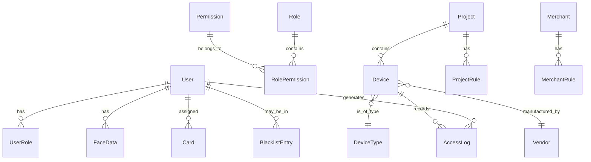

# AFA办公小程序高级功能设计文档

## 概述

本设计文档基于AFA办公小程序的高级功能需求，在现有MVP版本基础上，设计实现企业级的智能办公安全管理平台。系统将从基础通行管理升级为包含高级权限管理、多厂商设备集成、人脸识别、访客黑名单、通行分析等功能的完整解决方案。

设计遵循分层架构模式，采用微服务理念，确保系统的可扩展性、可维护性和安全性。

## 架构设计

### 整体架构

```
┌─────────────────────────────────────────────────────────────┐
│                    前端层 (Presentation Layer)                │
├─────────────────┬─────────────────┬─────────────────────────┤
│   租务管理端     │   商户管理端     │      访客小程序          │
│  (React + TS)   │  (React + TS)   │   (微信原生小程序)       │
└─────────────────┴─────────────────┴─────────────────────────┘
                            │
┌─────────────────────────────────────────────────────────────┐
│                    API网关层 (API Gateway)                   │
│              认证中间件 │ 权限中间件 │ 限流中间件              │
└─────────────────────────────────────────────────────────────┘
                            │
┌─────────────────────────────────────────────────────────────┐
│                   业务服务层 (Business Layer)                │
├──────────────┬──────────────┬──────────────┬───────────────┤
│  权限管理服务  │  设备管理服务  │  通行记录服务  │  通知服务     │
│  访客管理服务  │  人脸识别服务  │  规则配置服务  │  分析服务     │
└──────────────┴──────────────┴──────────────┴───────────────┘
                            │
┌─────────────────────────────────────────────────────────────┐
│                   数据访问层 (Data Access Layer)             │
├──────────────┬──────────────┬──────────────┬───────────────┤
│   用户仓储    │   设备仓储    │   记录仓储    │   配置仓储     │
└──────────────┴──────────────┴──────────────┴───────────────┘
                            │
┌─────────────────────────────────────────────────────────────┐
│                    数据存储层 (Storage Layer)                │
├──────────────┬──────────────┬──────────────┬───────────────┤
│   MySQL      │   Redis      │   文件存储    │   日志存储     │
│  (主数据库)   │  (缓存/会话)  │  (人脸照片)   │  (操作日志)    │
└──────────────┴──────────────┴──────────────┴───────────────┘
```

### 核心设计原则

1. **分层架构**: 严格按照Controller -> Service -> Model -> Database的分层结构
2. **单一职责**: 每个服务模块负责特定的业务领域
3. **接口隔离**: 通过接口定义服务边界，降低耦合度
4. **依赖注入**: 使用依赖注入管理服务依赖关系
5. **事件驱动**: 关键业务操作通过事件机制解耦

## 组件和接口设计

### 1. 高级权限管理系统

#### 核心组件

**RoleService (角色服务)**
```typescript
interface IRoleService {
  createRole(roleData: CreateRoleDto): Promise<Role>;
  updateRolePermissions(roleId: number, permissions: Permission[]): Promise<void>;
  getRolesByTenant(tenantId: number): Promise<Role[]>;
  deleteRole(roleId: number): Promise<void>;
}
```

**PermissionService (权限服务)**
```typescript
interface IPermissionService {
  checkPermission(userId: number, resource: string, action: string): Promise<boolean>;
  getUserPermissions(userId: number): Promise<Permission[]>;
  assignRoleToUser(userId: number, roleId: number): Promise<void>;
  revokeRoleFromUser(userId: number, roleId: number): Promise<void>;
}
```

#### 权限模型设计

```typescript
interface Role {
  id: number;
  name: string;
  description: string;
  tenantId: number;
  permissions: Permission[];
  createdAt: Date;
  updatedAt: Date;
}

interface Permission {
  id: number;
  resource: string;  // 资源类型: 'user', 'visitor', 'device'
  action: string;    // 操作类型: 'create', 'read', 'update', 'delete'
  scope: string;     // 权限范围: 'tenant', 'merchant', 'self'
}

interface UserRole {
  userId: number;
  roleId: number;
  assignedBy: number;
  assignedAt: Date;
}
```

#### 设计决策

- **RBAC模型**: 采用基于角色的访问控制，支持角色继承和权限组合
- **细粒度权限**: 支持菜单级别和操作级别的权限控制
- **动态权限**: 权限变更实时生效，通过Redis缓存提升性能
- **权限范围**: 通过scope字段实现租务、商户、个人三级权限隔离

### 2. 通行设备管理系统

#### 核心组件

**DeviceService (设备服务)**
```typescript
interface IDeviceService {
  registerDevice(deviceData: CreateDeviceDto): Promise<Device>;
  updateDeviceConfig(deviceId: number, config: DeviceConfig): Promise<void>;
  getDevicesByProject(projectId: number): Promise<Device[]>;
  checkDeviceStatus(deviceId: number): Promise<DeviceStatus>;
  handleDeviceHeartbeat(deviceId: number, status: DeviceStatus): Promise<void>;
}
```

**DeviceTypeService (设备类型服务)**
```typescript
interface IDeviceTypeService {
  createDeviceType(typeData: CreateDeviceTypeDto): Promise<DeviceType>;
  getDeviceTypes(): Promise<DeviceType[]>;
  updateDeviceType(typeId: number, typeData: UpdateDeviceTypeDto): Promise<void>;
}
```

#### 数据模型

```typescript
interface Device {
  id: number;
  name: string;
  deviceCode: string;
  deviceTypeId: number;
  projectId: number;
  vendorId: number;
  location: string;
  config: DeviceConfig;
  status: DeviceStatus;
  lastHeartbeat: Date;
  createdAt: Date;
  updatedAt: Date;
}

interface DeviceType {
  id: number;
  name: string;
  description: string;
  supportedMethods: VerificationMethod[];
  configSchema: object;
}

interface DeviceConfig {
  accessRules: AccessRule[];
  timeRestrictions: TimeRestriction[];
  verificationMethods: VerificationMethod[];
  alertSettings: AlertSettings;
}
```

#### 设计决策

- **设备抽象**: 通过DeviceType实现不同设备类型的统一管理
- **配置驱动**: 使用JSON Schema定义设备配置结构，支持灵活配置
- **状态监控**: 实时监控设备状态，支持离线检测和故障告警
- **扩展性**: 预留接口支持新设备类型的快速接入

### 3. 通行厂商对接管理

#### 核心组件

**VendorService (厂商服务)**
```typescript
interface IVendorService {
  registerVendor(vendorData: CreateVendorDto): Promise<Vendor>;
  updateVendorConfig(vendorId: number, config: VendorConfig): Promise<void>;
  testVendorConnection(vendorId: number): Promise<ConnectionTestResult>;
  getVendorDevices(vendorId: number): Promise<Device[]>;
}
```

**VendorAdapterFactory (厂商适配器工厂)**
```typescript
interface IVendorAdapter {
  syncUserData(users: User[]): Promise<SyncResult>;
  syncFaceData(faceData: FaceData[]): Promise<SyncResult>;
  validateAccess(deviceId: number, credential: Credential): Promise<AccessResult>;
  getAccessLogs(deviceId: number, timeRange: TimeRange): Promise<AccessLog[]>;
}

class VendorAdapterFactory {
  static createAdapter(vendorType: string, config: VendorConfig): IVendorAdapter;
}
```

#### 数据模型

```typescript
interface Vendor {
  id: number;
  name: string;
  type: string;
  description: string;
  config: VendorConfig;
  apiEndpoint: string;
  authConfig: AuthConfig;
  status: VendorStatus;
  createdAt: Date;
  updatedAt: Date;
}

interface VendorConfig {
  apiVersion: string;
  timeout: number;
  retryCount: number;
  encryptionKey?: string;
  customParams: Record<string, any>;
}
```

#### 设计决策

- **适配器模式**: 使用适配器模式统一不同厂商的接口差异
- **工厂模式**: 通过工厂模式动态创建厂商适配器
- **配置驱动**: 支持厂商特定的配置参数和认证方式
- **容错机制**: 实现重试机制和降级策略，确保系统稳定性

### 4. 访客黑名单管理

#### 核心组件

**BlacklistService (黑名单服务)**
```typescript
interface IBlacklistService {
  addToBlacklist(visitorInfo: VisitorInfo, reason: string): Promise<BlacklistEntry>;
  removeFromBlacklist(entryId: number): Promise<void>;
  checkBlacklist(visitorInfo: VisitorInfo): Promise<BlacklistCheckResult>;
  getBlacklistEntries(filters: BlacklistFilters): Promise<BlacklistEntry[]>;
  updateBlacklistEntry(entryId: number, updates: BlacklistUpdate): Promise<void>;
}
```

#### 数据模型

```typescript
interface BlacklistEntry {
  id: number;
  phone?: string;
  idCard?: string;
  name?: string;
  reason: string;
  addedBy: number;
  addedAt: Date;
  status: BlacklistStatus;
  expiresAt?: Date;
  notes?: string;
}

interface BlacklistCheckResult {
  isBlacklisted: boolean;
  entry?: BlacklistEntry;
  matchedFields: string[];
}
```

#### 设计决策

- **多字段匹配**: 支持手机号、身份证号、姓名等多种匹配方式
- **模糊匹配**: 实现智能匹配算法，防止恶意规避
- **时效管理**: 支持黑名单过期时间设置
- **审计追踪**: 完整记录黑名单操作历史

### 5. 通行规则配置系统

#### 核心组件

**RuleConfigService (规则配置服务)**
```typescript
interface IRuleConfigService {
  createProjectRule(projectId: number, rule: ProjectRule): Promise<void>;
  createMerchantRule(merchantId: number, rule: MerchantRule): Promise<void>;
  getEffectiveRules(context: RuleContext): Promise<EffectiveRules>;
  validateRuleConfig(rule: RuleConfig): Promise<ValidationResult>;
}
```

#### 规则引擎设计

```typescript
interface RuleEngine {
  evaluateRules(context: RuleContext): Promise<RuleResult>;
  addRule(rule: Rule): void;
  removeRule(ruleId: number): void;
}

interface Rule {
  id: number;
  type: RuleType;
  priority: number;
  conditions: Condition[];
  actions: Action[];
  isActive: boolean;
}

interface RuleContext {
  userId: number;
  userType: UserType;
  merchantId?: number;
  projectId: number;
  deviceId: number;
  timestamp: Date;
}
```

#### 设计决策

- **规则引擎**: 实现灵活的规则引擎，支持复杂业务规则配置
- **优先级机制**: 通过优先级解决规则冲突问题
- **继承机制**: 商户规则继承项目默认规则，支持覆盖
- **实时生效**: 规则变更实时生效，无需重启服务

### 6. 人脸识别系统

#### 核心组件

**FaceRecognitionService (人脸识别服务)**
```typescript
interface IFaceRecognitionService {
  uploadFacePhoto(userId: number, photoData: Buffer): Promise<FaceUploadResult>;
  syncFaceDataToDevice(deviceId: number, timeRange?: TimeRange): Promise<SyncResult>;
  validateFacePhoto(photoData: Buffer): Promise<ValidationResult>;
  deleteFaceData(userId: number): Promise<void>;
  getFaceUpdatesByDevice(deviceId: number, lastSync: Date): Promise<FaceUpdate[]>;
}
```

#### 数据模型

```typescript
interface FaceData {
  id: number;
  userId: number;
  photoPath: string;
  featureData: string;
  quality: number;
  status: FaceDataStatus;
  createdAt: Date;
  updatedAt: Date;
  deletedAt?: Date;
}

interface FaceUpdate {
  userId: number;
  operation: 'ADD' | 'UPDATE' | 'DELETE';
  faceData?: FaceData;
  timestamp: Date;
}
```

#### 设计决策

- **质量检测**: 上传时进行人脸质量检测，确保识别准确率
- **增量同步**: 支持增量数据同步，减少网络传输量
- **软删除**: 采用软删除机制，支持数据恢复
- **特征提取**: 预处理人脸特征数据，提升设备端识别速度

### 7. 刷卡通行系统

#### 核心组件

**CardService (卡片服务)**
```typescript
interface ICardService {
  assignCard(userId: number, cardNumber: string): Promise<CardAssignment>;
  revokeCard(cardId: number): Promise<void>;
  reportLostCard(cardId: number): Promise<void>;
  validateCardAccess(cardNumber: string, deviceId: number): Promise<AccessResult>;
  getCardsByUser(userId: number): Promise<Card[]>;
}
```

#### 数据模型

```typescript
interface Card {
  id: number;
  cardNumber: string;
  cardType: CardType;
  userId?: number;
  status: CardStatus;
  assignedAt?: Date;
  assignedBy?: number;
  expiresAt?: Date;
  createdAt: Date;
  updatedAt: Date;
}

interface CardAssignment {
  cardId: number;
  userId: number;
  assignedBy: number;
  assignedAt: Date;
  notes?: string;
}
```

#### 设计决策

- **卡片池管理**: 维护卡片池，支持卡片的分配和回收
- **状态管理**: 完整的卡片状态流转，包括激活、挂失、注销等
- **安全机制**: 支持卡片挂失和紧急冻结功能
- **审计日志**: 记录所有卡片操作历史

### 8. 通行记录分析系统

#### 核心组件

**AccessAnalyticsService (通行分析服务)**
```typescript
interface IAccessAnalyticsService {
  generateAccessReport(params: ReportParams): Promise<AccessReport>;
  getAccessStatistics(params: StatisticsParams): Promise<AccessStatistics>;
  detectAnomalousAccess(params: AnomalyParams): Promise<AnomalyResult[]>;
  exportAccessData(params: ExportParams): Promise<ExportResult>;
}
```

#### 分析模型

```typescript
interface AccessReport {
  summary: AccessSummary;
  timeDistribution: TimeDistribution[];
  userRanking: UserAccessRanking[];
  deviceUsage: DeviceUsageStats[];
  anomalies: AccessAnomaly[];
}

interface AccessStatistics {
  totalAccess: number;
  uniqueUsers: number;
  peakHours: PeakHour[];
  accessTrends: AccessTrend[];
}
```

#### 设计决策

- **实时分析**: 基于流处理的实时数据分析
- **多维度统计**: 支持时间、人员、设备、方向等多维度分析
- **异常检测**: 基于机器学习的异常行为检测
- **数据导出**: 支持多种格式的数据导出功能

## 数据模型设计

### 核心实体关系



### 数据库表设计

#### 权限管理相关表

```sql
-- 角色表
CREATE TABLE roles (
    id INT PRIMARY KEY AUTO_INCREMENT,
    name VARCHAR(100) NOT NULL,
    description TEXT,
    tenant_id INT,
    is_system_role BOOLEAN DEFAULT FALSE,
    created_at TIMESTAMP DEFAULT CURRENT_TIMESTAMP,
    updated_at TIMESTAMP DEFAULT CURRENT_TIMESTAMP ON UPDATE CURRENT_TIMESTAMP,
    INDEX idx_tenant_id (tenant_id)
);

-- 权限表
CREATE TABLE permissions (
    id INT PRIMARY KEY AUTO_INCREMENT,
    resource VARCHAR(50) NOT NULL,
    action VARCHAR(50) NOT NULL,
    scope VARCHAR(20) NOT NULL,
    description TEXT,
    UNIQUE KEY uk_resource_action_scope (resource, action, scope)
);

-- 角色权限关联表
CREATE TABLE role_permissions (
    role_id INT,
    permission_id INT,
    PRIMARY KEY (role_id, permission_id),
    FOREIGN KEY (role_id) REFERENCES roles(id) ON DELETE CASCADE,
    FOREIGN KEY (permission_id) REFERENCES permissions(id) ON DELETE CASCADE
);

-- 用户角色关联表
CREATE TABLE user_roles (
    user_id INT,
    role_id INT,
    assigned_by INT,
    assigned_at TIMESTAMP DEFAULT CURRENT_TIMESTAMP,
    PRIMARY KEY (user_id, role_id),
    FOREIGN KEY (user_id) REFERENCES users(id) ON DELETE CASCADE,
    FOREIGN KEY (role_id) REFERENCES roles(id) ON DELETE CASCADE,
    FOREIGN KEY (assigned_by) REFERENCES users(id)
);
```

#### 设备管理相关表

```sql
-- 厂商表
CREATE TABLE vendors (
    id INT PRIMARY KEY AUTO_INCREMENT,
    name VARCHAR(100) NOT NULL,
    type VARCHAR(50) NOT NULL,
    description TEXT,
    api_endpoint VARCHAR(255),
    auth_config JSON,
    vendor_config JSON,
    status ENUM('active', 'inactive', 'maintenance') DEFAULT 'active',
    created_at TIMESTAMP DEFAULT CURRENT_TIMESTAMP,
    updated_at TIMESTAMP DEFAULT CURRENT_TIMESTAMP ON UPDATE CURRENT_TIMESTAMP
);

-- 设备类型表
CREATE TABLE device_types (
    id INT PRIMARY KEY AUTO_INCREMENT,
    name VARCHAR(100) NOT NULL,
    description TEXT,
    supported_methods JSON,
    config_schema JSON,
    created_at TIMESTAMP DEFAULT CURRENT_TIMESTAMP
);

-- 设备表
CREATE TABLE devices (
    id INT PRIMARY KEY AUTO_INCREMENT,
    name VARCHAR(100) NOT NULL,
    device_code VARCHAR(100) UNIQUE NOT NULL,
    device_type_id INT,
    project_id INT,
    vendor_id INT,
    location VARCHAR(255),
    device_config JSON,
    status ENUM('online', 'offline', 'error', 'maintenance') DEFAULT 'offline',
    last_heartbeat TIMESTAMP,
    created_at TIMESTAMP DEFAULT CURRENT_TIMESTAMP,
    updated_at TIMESTAMP DEFAULT CURRENT_TIMESTAMP ON UPDATE CURRENT_TIMESTAMP,
    FOREIGN KEY (device_type_id) REFERENCES device_types(id),
    FOREIGN KEY (project_id) REFERENCES projects(id),
    FOREIGN KEY (vendor_id) REFERENCES vendors(id),
    INDEX idx_project_id (project_id),
    INDEX idx_device_code (device_code)
);
```

#### 人脸识别相关表

```sql
-- 人脸数据表
CREATE TABLE face_data (
    id INT PRIMARY KEY AUTO_INCREMENT,
    user_id INT NOT NULL,
    photo_path VARCHAR(500),
    feature_data TEXT,
    quality DECIMAL(3,2),
    status ENUM('active', 'inactive', 'deleted') DEFAULT 'active',
    created_at TIMESTAMP DEFAULT CURRENT_TIMESTAMP,
    updated_at TIMESTAMP DEFAULT CURRENT_TIMESTAMP ON UPDATE CURRENT_TIMESTAMP,
    deleted_at TIMESTAMP NULL,
    FOREIGN KEY (user_id) REFERENCES users(id) ON DELETE CASCADE,
    INDEX idx_user_id (user_id),
    INDEX idx_status (status)
);

-- 人脸数据同步记录表
CREATE TABLE face_sync_logs (
    id INT PRIMARY KEY AUTO_INCREMENT,
    device_id INT NOT NULL,
    sync_type ENUM('full', 'incremental') DEFAULT 'incremental',
    start_time TIMESTAMP,
    end_time TIMESTAMP,
    records_count INT DEFAULT 0,
    status ENUM('pending', 'success', 'failed') DEFAULT 'pending',
    error_message TEXT,
    created_at TIMESTAMP DEFAULT CURRENT_TIMESTAMP,
    FOREIGN KEY (device_id) REFERENCES devices(id),
    INDEX idx_device_id (device_id),
    INDEX idx_created_at (created_at)
);
```

#### 黑名单相关表

```sql
-- 访客黑名单表
CREATE TABLE visitor_blacklist (
    id INT PRIMARY KEY AUTO_INCREMENT,
    phone VARCHAR(20),
    id_card VARCHAR(30),
    name VARCHAR(100),
    reason TEXT NOT NULL,
    added_by INT NOT NULL,
    added_at TIMESTAMP DEFAULT CURRENT_TIMESTAMP,
    status ENUM('active', 'expired', 'removed') DEFAULT 'active',
    expires_at TIMESTAMP NULL,
    notes TEXT,
    FOREIGN KEY (added_by) REFERENCES users(id),
    INDEX idx_phone (phone),
    INDEX idx_id_card (id_card),
    INDEX idx_status (status)
);
```

## 错误处理策略

### 错误分类和编码

```typescript
enum ErrorCode {
  // 系统错误 (1xxx)
  SYSTEM_ERROR = 1000,
  DATABASE_ERROR = 1001,
  NETWORK_ERROR = 1002,
  
  // 业务错误 (2xxx)
  USER_NOT_FOUND = 2001,
  INVALID_CREDENTIALS = 2002,
  BLACKLISTED_VISITOR = 2003,
  DEVICE_OFFLINE = 2004,
  
  // 权限错误 (3xxx)
  INSUFFICIENT_PERMISSION = 3001,
  ROLE_NOT_FOUND = 3002,
  
  // 参数错误 (4xxx)
  INVALID_PARAMETER = 4001,
  MISSING_REQUIRED_FIELD = 4002,
  INVALID_FILE_FORMAT = 4003
}
```

### 统一错误处理

```typescript
class BusinessError extends Error {
  constructor(
    public code: ErrorCode,
    public message: string,
    public details?: any
  ) {
    super(message);
    this.name = 'BusinessError';
  }
}

// 全局错误处理中间件
export const errorHandler = (
  error: Error,
  req: Request,
  res: Response,
  next: NextFunction
) => {
  const response = {
    success: false,
    code: error instanceof BusinessError ? error.code : ErrorCode.SYSTEM_ERROR,
    message: error.message,
    data: null,
    timestamp: new Date().toISOString()
  };

  // 记录错误日志
  logger.error('API Error', {
    error: error.message,
    stack: error.stack,
    url: req.url,
    method: req.method,
    userId: req.user?.id
  });

  res.status(getHttpStatusCode(response.code)).json(response);
};
```

## 测试策略

### 测试金字塔

```
    ┌─────────────────┐
    │   E2E Tests     │  <- 少量关键流程测试
    │     (10%)       │
    ├─────────────────┤
    │ Integration     │  <- 服务间集成测试
    │   Tests (30%)   │
    ├─────────────────┤
    │  Unit Tests     │  <- 大量单元测试
    │    (60%)        │
    └─────────────────┘
```

### 测试分层策略

**单元测试**
- 服务层业务逻辑测试
- 工具函数测试
- 数据验证测试
- 权限检查测试

**集成测试**
- API接口测试
- 数据库操作测试
- 外部服务集成测试
- 设备通信测试

**端到端测试**
- 完整业务流程测试
- 用户权限流程测试
- 设备通行流程测试

### 测试数据管理

```typescript
// 测试数据工厂
export class TestDataFactory {
  static createUser(overrides?: Partial<User>): User {
    return {
      id: faker.number.int(),
      userName: faker.internet.userName(),
      email: faker.internet.email(),
      phone: faker.phone.number(),
      ...overrides
    };
  }

  static createDevice(overrides?: Partial<Device>): Device {
    return {
      id: faker.number.int(),
      name: faker.company.name(),
      deviceCode: faker.string.alphanumeric(10),
      status: 'online',
      ...overrides
    };
  }
}
```

## 性能优化策略

### 缓存策略

**Redis缓存层次**
```typescript
// L1: 用户权限缓存 (TTL: 30分钟)
const userPermissionsKey = `user:${userId}:permissions`;

// L2: 设备状态缓存 (TTL: 5分钟)
const deviceStatusKey = `device:${deviceId}:status`;

// L3: 规则配置缓存 (TTL: 1小时)
const ruleConfigKey = `rules:${projectId}:${merchantId}`;
```

### 数据库优化

**索引策略**
- 所有外键建立索引
- 查询频繁的字段组合索引
- 时间范围查询的时间字段索引

**查询优化**
- 使用连接池管理数据库连接
- 实施读写分离
- 大数据量查询使用分页和游标

### API性能优化

**响应时间目标**
- 权限检查: < 50ms
- 设备状态查询: < 100ms
- 通行记录查询: < 200ms
- 数据分析报表: < 2s

## 安全设计

### 认证授权

**JWT Token设计**
```typescript
interface JWTPayload {
  userId: number;
  userType: UserType;
  merchantId?: number;
  tenantId?: number;
  permissions: string[];
  iat: number;
  exp: number;
}
```

### 数据安全

**敏感数据加密**
- 身份证号: AES-256加密存储
- 手机号: 部分掩码显示
- 人脸特征数据: 加密存储

**API安全**
- 所有API需要认证
- 敏感操作需要二次验证
- 实施API限流和防刷机制

### 审计日志

```typescript
interface AuditLog {
  id: number;
  userId: number;
  action: string;
  resource: string;
  resourceId: number;
  oldValue?: object;
  newValue?: object;
  ipAddress: string;
  userAgent: string;
  timestamp: Date;
}
```

## 部署架构

### 容器化部署

```yaml
# docker-compose.yml
version: '3.8'
services:
  api-server:
    image: afa-office-api:latest
    ports:
      - "3000:3000"
    environment:
      - NODE_ENV=production
      - DATABASE_URL=${DATABASE_URL}
      - REDIS_URL=${REDIS_URL}
    depends_on:
      - mysql
      - redis

  mysql:
    image: mysql:8.0
    environment:
      - MYSQL_ROOT_PASSWORD=${MYSQL_ROOT_PASSWORD}
      - MYSQL_DATABASE=afa_office
    volumes:
      - mysql_data:/var/lib/mysql

  redis:
    image: redis:7-alpine
    volumes:
      - redis_data:/data

volumes:
  mysql_data:
  redis_data:
```

### 监控和日志

**应用监控**
- 使用Prometheus + Grafana监控系统指标
- 实施健康检查端点
- 设置关键指标告警

**日志管理**
- 结构化日志输出
- 日志级别分层
- 敏感信息脱敏

这个设计文档为AFA办公小程序的高级功能提供了完整的技术架构和实现方案，确保系统的可扩展性、安全性和可维护性。