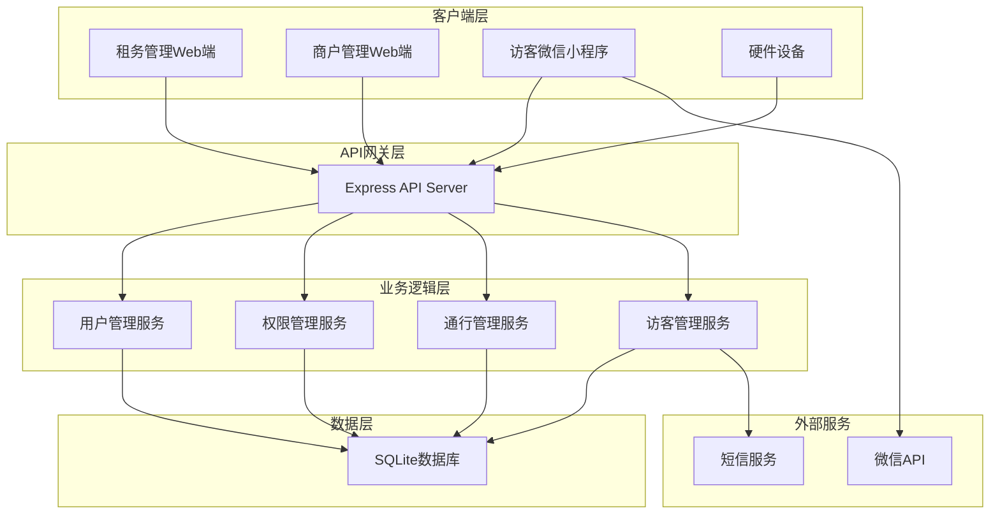

# AFA办公小程序 MVP 设计文档

## 概述

AFA办公小程序是一个基于Node.js的全栈办公通行管理系统，采用前后端分离架构。系统包含后端API服务、租务管理Web端、商户管理Web端和访客微信小程序四个主要组件。

### 技术栈选择
- **后端**: Node.js + Express + SQLite (开发环境)
- **前端管理后台**: React + Ant Design + Axios
- **微信小程序**: 原生小程序开发
- **认证**: JWT + 微信OAuth
- **测试**: Vitest + Supertest
- **部署**: Docker + PM2

### 项目目录结构

```
afa-office-system/
├── backend/                    # 后端API服务
│   ├── src/
│   │   ├── controllers/        # 控制器层
│   │   │   ├── auth.controller.js
│   │   │   ├── tenant.controller.js
│   │   │   ├── merchant.controller.js
│   │   │   ├── visitor.controller.js
│   │   │   └── access.controller.js
│   │   ├── services/           # 业务逻辑层
│   │   │   ├── auth.service.js
│   │   │   ├── permission.service.js
│   │   │   ├── passcode.service.js
│   │   │   └── notification.service.js
│   │   ├── models/             # 数据模型层
│   │   │   ├── user.model.js
│   │   │   ├── merchant.model.js
│   │   │   ├── visitor.model.js
│   │   │   └── access.model.js
│   │   ├── middleware/         # 中间件
│   │   │   ├── auth.middleware.js
│   │   │   ├── permission.middleware.js
│   │   │   └── validation.middleware.js
│   │   ├── routes/             # 路由定义
│   │   │   ├── v1/             # v1版本路由
│   │   │   │   ├── auth.routes.js
│   │   │   │   ├── tenant.routes.js
│   │   │   │   ├── merchant.routes.js
│   │   │   │   └── visitor.routes.js
│   │   │   ├── index.js        # 路由入口和版本管理
│   │   │   └── middleware.js   # 版本控制中间件
│   │   ├── utils/              # 工具函数
│   │   │   ├── database.js
│   │   │   ├── jwt.js
│   │   │   ├── qrcode.js
│   │   │   └── wechat.js
│   │   ├── config/             # 配置文件
│   │   │   ├── database.config.js
│   │   │   ├── jwt.config.js
│   │   │   └── wechat.config.js
│   │   └── app.js              # 应用入口
│   ├── tests/                  # 测试文件
│   │   ├── unit/               # 单元测试
│   │   │   ├── services/
│   │   │   ├── models/
│   │   │   └── utils/
│   │   ├── integration/        # 集成测试
│   │   │   ├── auth.test.js
│   │   │   ├── merchant.test.js
│   │   │   └── visitor.test.js
│   │   ├── fixtures/           # 测试数据
│   │   │   ├── users.json
│   │   │   └── merchants.json
│   │   └── setup.js            # 测试环境配置
│   ├── database/               # 数据库相关
│   │   ├── migrations/         # 数据库迁移
│   │   ├── seeds/              # 初始数据
│   │   └── schema.sql          # 数据库结构
│   ├── package.json
│   ├── vitest.config.js        # 测试配置
│   └── .env.example            # 环境变量示例
├── frontend/                   # 前端管理后台
│   ├── tenant-admin/           # 租务管理端
│   │   ├── src/
│   │   │   ├── components/     # 通用组件
│   │   │   ├── pages/          # 页面组件
│   │   │   │   ├── merchants/
│   │   │   │   ├── spaces/
│   │   │   │   └── access/
│   │   │   ├── services/       # API服务
│   │   │   ├── utils/          # 工具函数
│   │   │   ├── hooks/          # 自定义Hooks
│   │   │   └── App.jsx
│   │   ├── public/
│   │   └── package.json
│   └── merchant-admin/         # 商户管理端
│       ├── src/
│       │   ├── components/
│       │   ├── pages/
│       │   │   ├── employees/
│       │   │   ├── visitors/
│       │   │   └── settings/
│       │   ├── services/
│       │   └── App.jsx
│       └── package.json
├── miniprogram/                # 微信小程序
│   ├── pages/                  # 页面
│   │   ├── index/              # 首页
│   │   ├── login/              # 登录页
│   │   ├── visitor/            # 访客相关页面
│   │   │   ├── apply/          # 访客申请
│   │   │   └── passcode/       # 通行码
│   │   └── employee/           # 员工相关页面
│   │       ├── apply/          # 员工申请
│   │       ├── passcode/       # 员工通行码
│   │       └── approve/        # 访客审批
│   ├── components/             # 组件
│   ├── utils/                  # 工具函数
│   ├── services/               # API服务
│   ├── app.js                  # 小程序入口
│   └── app.json                # 小程序配置
├── docs/                       # 项目文档
│   ├── api/                    # API文档
│   │   ├── v1/                 # v1版本API文档
│   │   │   ├── auth.md
│   │   │   ├── tenant.md
│   │   │   ├── merchant.md
│   │   │   └── visitor.md
│   │   └── changelog.md        # API版本变更日志
│   ├── deployment/             # 部署文档
│   │   ├── docker.md
│   │   └── production.md
│   ├── development/            # 开发文档
│   │   ├── setup.md
│   │   ├── database.md
│   │   └── testing.md
│   └── README.md               # 项目说明
├── scripts/                    # 脚本文件
│   ├── build.sh                # 构建脚本
│   ├── deploy.sh               # 部署脚本
│   └── test.sh                 # 测试脚本
├── docker-compose.yml          # Docker编排
├── .gitignore
└── README.md
```

## 架构设计

### 系统架构图



### 模块划分

1. **认证授权模块** - 处理用户登录、权限验证
2. **租务管理模块** - 商户管理、空间管理、权限分配
3. **商户管理模块** - 员工管理、访客审批
4. **访客服务模块** - 预约申请、通行码生成
5. **通行验证模块** - 二维码验证、通行记录
6. **基础数据模块** - 项目、场地、楼层管理

## 组件和接口设计

### 核心组件

#### 1. API服务器 (Express App)
```javascript
// 主要中间件和路由配置
- 身份认证中间件 (JWT验证)
- 权限控制中间件 (RBAC)
- 请求日志中间件
- 错误处理中间件
- 路由模块 (租务/商户/访客/通行)
```

#### 2. 认证服务 (AuthService)
```javascript
// 核心方法
- login(credentials) // 用户登录
- generateToken(user) // 生成JWT token
- verifyToken(token) // 验证token
- wechatAuth(code) // 微信授权登录
- refreshToken(token) // 刷新token
```

#### 3. 权限管理服务 (PermissionService)
```javascript
// 核心方法
- checkPermission(userId, resource, action) // 权限检查
- assignPermission(userId, permissions) // 分配权限
- getPermissions(userId) // 获取用户权限
- createRole(roleData) // 创建角色
- assignRole(userId, roleId) // 分配角色
```

#### 4. 通行码服务 (PasscodeService)
```javascript
// 核心方法
- generatePasscode(userId, type, duration) // 生成通行码
- validatePasscode(code, deviceId) // 验证通行码
- refreshPasscode(userId) // 刷新通行码
- recordAccess(userId, deviceId, result) // 记录通行
- getAccessHistory(userId) // 获取通行历史
```

### API接口设计

### API版本管理

系统采用URL路径版本控制策略，所有API接口都包含版本号：

```
/api/v1/...  # 当前版本
/api/v2/...  # 未来版本
```

#### 版本控制策略
- **向后兼容** - 新版本保持对旧版本的兼容性
- **渐进升级** - 客户端可以逐步迁移到新版本
- **版本废弃** - 旧版本有明确的废弃时间表
- **文档维护** - 每个版本都有独立的API文档

#### 认证相关接口
```
POST /api/v1/auth/login - 用户登录
POST /api/v1/auth/wechat-login - 微信登录
POST /api/v1/auth/refresh - 刷新token
POST /api/v1/auth/logout - 用户登出
```

#### 租务管理接口
```
GET /api/v1/tenant/merchants - 获取商户列表
POST /api/v1/tenant/merchants - 创建商户
PUT /api/v1/tenant/merchants/:id - 更新商户
DELETE /api/v1/tenant/merchants/:id - 删除商户
POST /api/v1/tenant/merchants/:id/permissions - 分配权限
GET /api/v1/tenant/spaces - 获取空间列表
POST /api/v1/tenant/spaces - 创建空间
```

#### 商户管理接口
```
GET /api/v1/merchant/employees - 获取员工列表
POST /api/v1/merchant/employees - 添加员工
POST /api/v1/merchant/employees/batch - 批量导入员工
PUT /api/v1/merchant/employees/:id - 更新员工
GET /api/v1/merchant/visitors - 获取访客申请
PUT /api/v1/merchant/visitors/:id/approve - 审批访客
```

#### 访客小程序接口
```
POST /api/v1/visitor/apply - 提交访客申请
GET /api/v1/visitor/applications - 获取我的申请
GET /api/v1/visitor/passcode/:id - 获取通行码
POST /api/v1/employee/apply - 员工申请
GET /api/v1/employee/passcode - 获取员工通行码
```

#### 通行验证接口
```
POST /api/v1/access/validate - 验证通行码
GET /api/v1/access/history - 获取通行记录
POST /api/v1/access/photos - 获取人脸照片(硬件对接)
```

## 数据模型设计

### 用户相关模型

#### User (用户表)
```sql
CREATE TABLE users (
  id INTEGER PRIMARY KEY AUTOINCREMENT,
  open_id TEXT UNIQUE, -- 微信openId
  union_id TEXT, -- 微信unionId  
  phone TEXT,
  name TEXT,
  avatar TEXT,
  user_type TEXT CHECK(user_type IN ('tenant_admin', 'merchant_admin', 'employee', 'visitor')),
  status TEXT CHECK(status IN ('active', 'inactive', 'pending')) DEFAULT 'active',
  merchant_id INTEGER, -- 所属商户ID
  created_at DATETIME DEFAULT CURRENT_TIMESTAMP,
  updated_at DATETIME DEFAULT CURRENT_TIMESTAMP,
  FOREIGN KEY (merchant_id) REFERENCES merchants(id)
)
```

#### Merchant (商户表)
```javascript
{
  _id: ObjectId,
  name: String,
  code: String, // 商户编码
  contact: String, // 联系人
  phone: String,
  email: String,
  address: String,
  status: String, // 'active', 'inactive'
  permissions: [String], // 拥有的权限代码
  settings: {
    visitorApprovalMode: String, // 'admin', 'visitee', 'both'
    passcodeUpdateFreq: Number, // 通行码更新频率(分钟)
    visitorPasscodeLimit: Number // 访客通行码使用次数限制
  },
  createdAt: Date,
  updatedAt: Date
}
```

### 空间相关模型

#### Project (项目表)
```javascript
{
  _id: ObjectId,
  code: String, // 项目编码
  name: String,
  description: String,
  status: String, // 'active', 'inactive'
  createdAt: Date,
  updatedAt: Date
}
```

#### Venue (场地表)
```javascript
{
  _id: ObjectId,
  projectId: ObjectId,
  code: String, // 场地编码
  name: String,
  description: String,
  status: String,
  createdAt: Date,
  updatedAt: Date
}
```

#### Floor (楼层表)
```javascript
{
  _id: ObjectId,
  venueId: ObjectId,
  code: String, // 楼层编码
  name: String,
  description: String,
  status: String,
  createdAt: Date,
  updatedAt: Date
}
```

### 权限相关模型

#### Permission (权限表)
```javascript
{
  _id: ObjectId,
  code: String, // 权限代码
  name: String,
  description: String,
  resourceType: String, // 'project', 'venue', 'floor'
  resourceId: ObjectId,
  actions: [String], // ['read', 'write', 'access']
  createdAt: Date
}
```

#### Role (角色表)
```javascript
{
  _id: ObjectId,
  merchantId: ObjectId,
  name: String,
  description: String,
  permissions: [String], // 权限代码数组
  createdAt: Date,
  updatedAt: Date
}
```

### 访客相关模型

#### VisitorApplication (访客申请表)
```javascript
{
  _id: ObjectId,
  applicantId: ObjectId, // 申请人ID
  merchantId: ObjectId, // 被访商户ID
  visiteeId: ObjectId, // 被访人ID
  visitorName: String,
  visitorPhone: String,
  visitorCompany: String,
  visitPurpose: String,
  visitType: String, // 到访类型
  scheduledTime: Date, // 预约时间
  duration: Number, // 访问时长(小时)
  status: String, // 'pending', 'approved', 'rejected', 'expired'
  approvedBy: ObjectId, // 审批人ID
  approvedAt: Date,
  passcode: String, // 生成的通行码
  passcodeExpiry: Date, // 通行码过期时间
  usageLimit: Number, // 使用次数限制
  usageCount: Number, // 已使用次数
  createdAt: Date,
  updatedAt: Date
}
```

### 通行相关模型

#### Passcode (通行码表)
```javascript
{
  _id: ObjectId,
  userId: ObjectId,
  code: String, // 通行码内容
  type: String, // 'employee', 'visitor'
  status: String, // 'active', 'expired', 'revoked'
  expiryTime: Date,
  usageLimit: Number,
  usageCount: Number,
  permissions: [String], // 可通行的权限代码
  createdAt: Date,
  updatedAt: Date
}
```

#### AccessRecord (通行记录表)
```javascript
{
  _id: ObjectId,
  userId: ObjectId,
  passcodeId: ObjectId,
  deviceId: String, // 设备ID
  deviceType: String, // 设备类型
  direction: String, // 'in', 'out'
  result: String, // 'success', 'failed'
  failReason: String, // 失败原因
  location: {
    projectId: ObjectId,
    venueId: ObjectId,
    floorId: ObjectId
  },
  timestamp: Date
}
```

## 错误处理设计

### 错误码定义
```javascript
const ErrorCodes = {
  // 认证相关 1000-1999
  INVALID_CREDENTIALS: 1001,
  TOKEN_EXPIRED: 1002,
  INSUFFICIENT_PERMISSIONS: 1003,
  
  // 业务相关 2000-2999
  MERCHANT_NOT_FOUND: 2001,
  EMPLOYEE_ALREADY_EXISTS: 2002,
  VISITOR_APPLICATION_EXPIRED: 2003,
  PASSCODE_INVALID: 2004,
  PASSCODE_EXPIRED: 2005,
  USAGE_LIMIT_EXCEEDED: 2006,
  
  // 系统相关 9000-9999
  DATABASE_ERROR: 9001,
  EXTERNAL_SERVICE_ERROR: 9002
}
```

### 统一错误响应格式
```javascript
{
  success: false,
  code: 2004,
  message: "通行码无效",
  data: null,
  timestamp: "2024-01-01T00:00:00Z"
}
```

## 测试策略

### 单元测试
- 使用Vitest框架进行单元测试 (更快的启动速度和更好的ES模块支持)
- 覆盖所有业务逻辑函数
- Mock外部依赖(数据库、微信API等)
- 目标代码覆盖率: 80%以上

### 集成测试  
- 使用Supertest测试API接口
- 测试完整的业务流程
- 使用内存SQLite数据库进行测试

### 端到端测试
- 小程序端使用微信开发者工具的自动化测试
- Web端使用Playwright进行E2E测试 (比Cypress更稳定)
- 模拟真实用户操作场景

### 性能测试
- 使用Artillery进行API性能测试
- 重点测试通行码验证接口的并发性能
- 目标: 支持1000并发用户