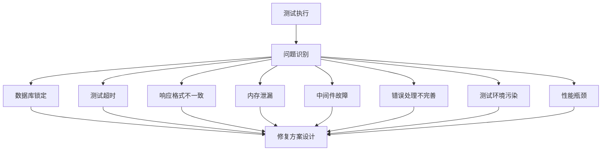
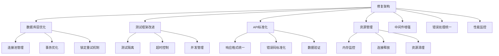
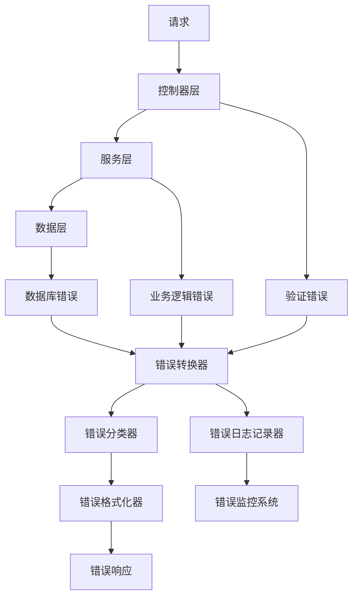
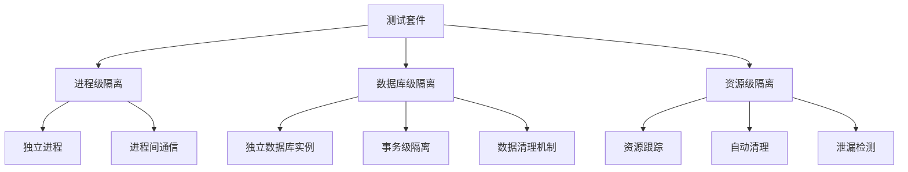
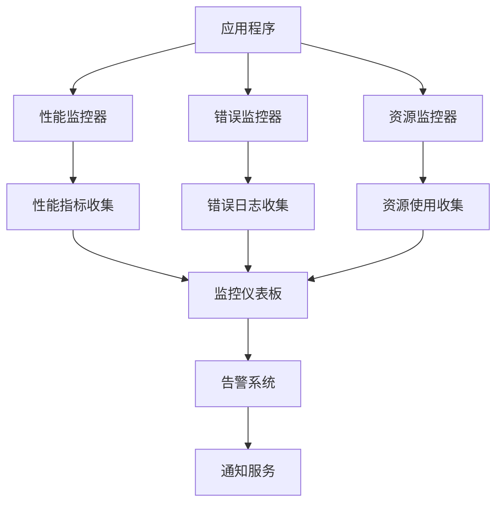

# 后端Bug修复设计文档

## 概述

本设计文档针对AFA办公小程序后端系统中发现的关键bug提供系统性的修复方案。通过分析测试结果和代码结构，我们识别出了8个主要问题领域，并设计了相应的解决方案来提高系统的稳定性、性能和可维护性。

## 架构

### 问题分析架构



### 修复架构设计



## 组件和接口

### 1. 数据库连接管理器

#### 增强的数据库类
```typescript
interface EnhancedDatabase {
  // 连接池管理
  connectionPool: ConnectionPool;
  
  // 重试机制
  executeWithRetry<T>(operation: () => Promise<T>, options?: RetryOptions): Promise<T>;
  
  // 事务管理
  withTransaction<T>(callback: (tx: Transaction) => Promise<T>): Promise<T>;
  
  // 健康检查
  healthCheck(): Promise<HealthStatus>;
  
  // 性能监控
  getPerformanceMetrics(): PerformanceMetrics;
}

interface RetryOptions {
  maxRetries: number;
  baseDelay: number;
  maxDelay: number;
  retryableErrors: string[];
}

interface ConnectionPool {
  acquire(): Promise<sqlite3.Database>;
  release(connection: sqlite3.Database): void;
  destroy(): Promise<void>;
  getStats(): PoolStats;
}
```

#### 数据库配置优化
```typescript
interface OptimizedDatabaseConfig {
  // 环境特定配置
  development: DatabaseEnvironmentConfig;
  test: DatabaseEnvironmentConfig;
  production: DatabaseEnvironmentConfig;
  
  // 连接池配置
  pool: {
    min: number;
    max: number;
    acquireTimeoutMillis: number;
    idleTimeoutMillis: number;
  };
  
  // 重试配置
  retry: RetryOptions;
  
  // 性能配置
  performance: {
    slowQueryThreshold: number;
    enableQueryLogging: boolean;
    enablePerformanceMetrics: boolean;
  };
}
```

### 2. 测试框架增强

#### 测试环境管理器
```typescript
interface TestEnvironmentManager {
  // 测试隔离
  createIsolatedEnvironment(): Promise<TestEnvironment>;
  cleanupEnvironment(env: TestEnvironment): Promise<void>;
  
  // 数据库管理
  setupTestDatabase(): Promise<void>;
  resetTestDatabase(): Promise<void>;
  
  // 并发控制
  acquireTestLock(testName: string): Promise<TestLock>;
  releaseTestLock(lock: TestLock): Promise<void>;
}

interface TestEnvironment {
  id: string;
  databasePath: string;
  isolationLevel: 'process' | 'thread' | 'test';
  cleanup: () => Promise<void>;
}
```

#### 超时管理器
```typescript
interface TimeoutManager {
  // 动态超时设置
  setTestTimeout(testName: string, timeout: number): void;
  
  // 超时监控
  monitorTestExecution(testName: string): Promise<ExecutionMetrics>;
  
  // 超时预警
  onTimeoutWarning(callback: (testName: string, elapsed: number) => void): void;
}
```

### 3. API响应标准化

#### 响应格式化器
```typescript
interface ResponseFormatter {
  // 成功响应
  success<T>(data: T, message?: string, meta?: ResponseMeta): StandardResponse<T>;
  
  // 错误响应
  error(error: AppError, request: Request): ErrorResponse;
  
  // 分页响应
  paginated<T>(data: T[], pagination: PaginationInfo): PaginatedResponse<T>;
}

interface StandardResponse<T> {
  success: true;
  data: T;
  message: string;
  timestamp: string;
  meta?: ResponseMeta;
}

interface ErrorResponse {
  success: false;
  code: number;
  message: string;
  data: null;
  timestamp: string;
  path: string;
  method: string;
  details?: any;
  stack?: string; // 仅开发环境
}
```

#### 错误码管理器
```typescript
interface ErrorCodeManager {
  // 错误码注册
  registerErrorCode(code: number, message: string, category: string): void;
  
  // 错误码查找
  getErrorInfo(code: number): ErrorInfo;
  
  // 错误分类
  categorizeError(error: Error): ErrorCategory;
}
```

### 4. 资源管理器

#### 内存监控器
```typescript
interface MemoryMonitor {
  // 内存使用监控
  startMonitoring(): void;
  stopMonitoring(): void;
  
  // 内存泄漏检测
  detectLeaks(): Promise<MemoryLeak[]>;
  
  // 内存使用报告
  getMemoryReport(): MemoryReport;
  
  // 内存告警
  onMemoryThreshold(threshold: number, callback: (usage: MemoryUsage) => void): void;
}

interface ResourceManager {
  // 资源跟踪
  trackResource(resource: Resource): void;
  releaseResource(resourceId: string): Promise<void>;
  
  // 资源清理
  cleanupResources(): Promise<void>;
  
  // 资源统计
  getResourceStats(): ResourceStats;
}
```

### 5. 中间件增强

#### 验证中间件增强
```typescript
interface EnhancedValidationMiddleware {
  // 动态验证规则
  validate(schema: ValidationSchema, options?: ValidationOptions): RequestHandler;
  
  // 批量验证
  validateBatch(schemas: ValidationSchemaMap): RequestHandler;
  
  // 条件验证
  validateIf(condition: (req: Request) => boolean, schema: ValidationSchema): RequestHandler;
  
  // 验证结果缓存
  cacheValidationResult(key: string, result: ValidationResult): void;
}

interface ValidationOptions {
  abortEarly: boolean;
  stripUnknown: boolean;
  allowUnknown: boolean;
  skipFunctions: boolean;
  cache: boolean;
}
```

#### 性能监控中间件
```typescript
interface PerformanceMiddleware {
  // 请求性能监控
  monitor(options?: MonitoringOptions): RequestHandler;
  
  // 慢请求检测
  detectSlowRequests(threshold: number): RequestHandler;
  
  // 性能指标收集
  collectMetrics(): RequestHandler;
}
```

## 数据模型

### 性能指标模型
```typescript
interface PerformanceMetrics {
  database: {
    connectionCount: number;
    activeConnections: number;
    queryCount: number;
    slowQueries: SlowQuery[];
    averageQueryTime: number;
  };
  
  memory: {
    heapUsed: number;
    heapTotal: number;
    external: number;
    rss: number;
  };
  
  requests: {
    totalRequests: number;
    averageResponseTime: number;
    slowRequests: SlowRequest[];
    errorRate: number;
  };
}
```

### 测试执行模型
```typescript
interface TestExecutionMetrics {
  testName: string;
  startTime: Date;
  endTime: Date;
  duration: number;
  status: 'passed' | 'failed' | 'timeout' | 'skipped';
  memoryUsage: MemoryUsage;
  databaseOperations: DatabaseOperation[];
  errors: TestError[];
}
```

## 错误处理

### 分层错误处理架构


### 错误处理策略

#### 1. 数据库错误处理
- **SQLITE_BUSY**: 实现指数退避重试机制
- **SQLITE_LOCKED**: 连接池管理和锁定检测
- **约束违反**: 业务友好的错误消息转换

#### 2. 超时错误处理
- **测试超时**: 动态超时调整和预警机制
- **请求超时**: 优雅的超时处理和资源清理
- **数据库超时**: 连接池超时管理

#### 3. 内存错误处理
- **内存泄漏**: 自动检测和告警
- **内存溢出**: 优雅降级和资源释放
- **GC压力**: 内存使用优化建议

## 测试策略

### 测试隔离策略


### 性能测试策略
1. **基准测试**: 建立性能基线
2. **负载测试**: 模拟高并发场景
3. **压力测试**: 测试系统极限
4. **内存测试**: 长期运行内存监控

### 测试数据管理
1. **数据工厂**: 标准化测试数据生成
2. **数据清理**: 自动化测试数据清理
3. **数据隔离**: 测试间数据互不影响
4. **数据一致性**: 确保测试数据的一致性

## 性能优化

### 数据库性能优化
1. **连接池优化**: 合理配置连接池参数
2. **查询优化**: 慢查询检测和优化建议
3. **索引优化**: 自动索引建议和监控
4. **事务优化**: 减少事务锁定时间

### 内存性能优化
1. **内存池**: 对象复用减少GC压力
2. **缓存策略**: 合理的缓存机制
3. **内存监控**: 实时内存使用监控
4. **泄漏检测**: 自动内存泄漏检测

### 并发性能优化
1. **锁优化**: 减少锁竞争
2. **异步处理**: 提高并发处理能力
3. **队列管理**: 请求队列优化
4. **资源调度**: 智能资源分配

## 监控和日志

### 监控架构


### 日志策略
1. **结构化日志**: 使用JSON格式便于分析
2. **日志级别**: 合理的日志级别划分
3. **日志轮转**: 自动日志文件管理
4. **敏感信息过滤**: 防止敏感信息泄露

### 告警机制
1. **性能告警**: 响应时间、吞吐量告警
2. **错误告警**: 错误率、异常告警
3. **资源告警**: 内存、CPU、磁盘告警
4. **业务告警**: 业务指标异常告警

## 部署和运维

### 部署策略
1. **渐进式部署**: 分阶段部署修复
2. **回滚机制**: 快速回滚能力
3. **健康检查**: 部署后健康状态检查
4. **性能验证**: 部署后性能验证

### 运维监控
1. **实时监控**: 系统实时状态监控
2. **趋势分析**: 性能趋势分析
3. **容量规划**: 基于监控数据的容量规划
4. **故障预警**: 潜在问题预警机制

## 安全考虑

### 错误信息安全
1. **敏感信息过滤**: 防止敏感信息泄露
2. **错误信息标准化**: 统一的错误信息格式
3. **日志安全**: 日志中的敏感信息处理
4. **调试信息控制**: 生产环境调试信息控制

### 资源安全
1. **资源限制**: 防止资源耗尽攻击
2. **连接限制**: 数据库连接数限制
3. **内存限制**: 内存使用限制
4. **超时保护**: 防止长时间占用资源

## 兼容性考虑

### 向后兼容性
1. **API兼容性**: 保持现有API接口兼容
2. **数据库兼容性**: 数据库结构变更兼容性
3. **配置兼容性**: 配置文件向后兼容
4. **依赖兼容性**: 第三方依赖版本兼容

### 环境兼容性
1. **开发环境**: 开发环境特定优化
2. **测试环境**: 测试环境隔离和优化
3. **生产环境**: 生产环境性能和稳定性优化
4. **CI/CD环境**: 持续集成环境适配