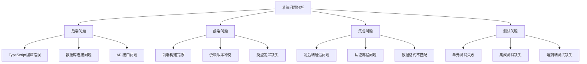
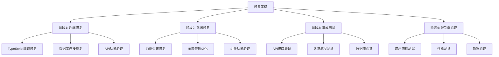
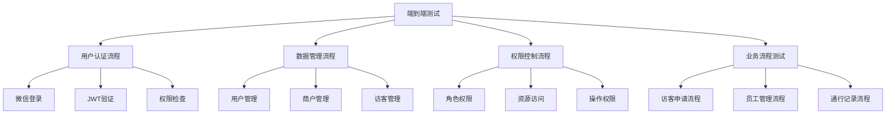
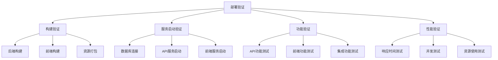
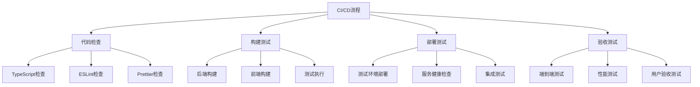

# AFA办公系统全面修复设计文档

## 概述

本设计文档针对AFA办公小程序系统的全面修复提供系统性解决方案。包括后端TypeScript编译错误修复、前端构建问题解决、API接口连通性验证、端到端测试建立和系统集成验证。采用分阶段实施策略，优先修复后端核心问题，然后扩展到前端和集成测试，最终建立完整的开发和测试流程。

## 架构

### 系统问题分析架构



### 分阶段修复策略



## 组件和接口

### 1. 数据库配置类型增强

#### SQLite配置接口
```typescript
interface SQLiteConfig {
  type: DatabaseType.SQLITE;
  path: string;
  mode?: number;
  pragmas?: Record<string, any>;
}
```

#### MySQL配置接口增强
```typescript
interface MySQLConfig {
  type: DatabaseType.MYSQL;
  host: string;
  port: number;
  user: string;
  password: string;
  database?: string;
  connectionLimit?: number;
  acquireTimeout?: number;
  timeout?: number;
  multipleStatements?: boolean;
  reconnect?: boolean;
  // 新增属性
  charset?: string;
  timezone?: string;
  ssl?: boolean | object;
  supportBigNumbers?: boolean;
  bigNumberStrings?: boolean;
  dateStrings?: boolean;
  debug?: boolean;
  trace?: boolean;
  idleTimeout?: number;
  queueLimit?: number;
}
```

#### 统一数据库配置类型
```typescript
type DatabaseConfig = SQLiteConfig | MySQLConfig;
```

### 2. 模型方法调用修复

#### 服务层模型使用模式
```typescript
// 修复前（错误）
class SomeService {
  constructor(private userModel: UserModel) {}
  
  async getUser(id: number) {
    return await this.userModel.findById(id); // 错误：实例调用静态方法
  }
}

// 修复后（正确）
class SomeService {
  async getUser(id: number) {
    return await UserModel.findById(id); // 正确：静态方法调用
  }
}
```

#### 依赖注入模式调整
```typescript
// 对于需要依赖注入的场景，使用工厂模式
interface ModelFactory {
  createUserModel(): typeof UserModel;
  createMerchantModel(): typeof MerchantModel;
}
```

### 3. 返回类型修复

#### 分页响应类型修复
```typescript
// 修复access-record.service.ts中的返回类型
async findAll(query: any): Promise<PaginatedResponse<AccessRecord>> {
  const records = await AccessRecordModel.findAll(query);
  return {
    data: records,
    pagination: {
      page: query.page || 1,
      pageSize: query.pageSize || 10,
      total: records.length
    }
  };
}
```

#### 属性访问安全化
```typescript
// 修复属性访问错误
const data = recentActivity?.data || [];
// 改为
const data = Array.isArray(recentActivity) ? recentActivity : 
             (recentActivity && 'data' in recentActivity ? recentActivity.data : []);
```

### 4. MySQL连接配置修复

#### 连接池配置类型扩展
```typescript
interface ExtendedPoolOptions extends mysql.PoolOptions {
  acquireTimeout?: number;
}
```

#### 事件监听器类型修复
```typescript
// 修复连接池事件监听
this.pool.on('connection' as any, (connection) => {
  // 处理连接事件
});

this.pool.on('error' as any, (error) => {
  // 处理错误事件
});
```

### 5. 导入导出修复

#### 模块导出修复
```typescript
// test-environment-manager.ts
export class TestEnvironmentManager {
  // 实现
}

// 同时提供实例导出（如果需要）
export const testEnvironmentManager = new TestEnvironmentManager();
```

#### 导入语句修复
```typescript
// 修复导入语句
import { TestEnvironmentManager } from './test-environment-manager.js';
// 或者
import { testEnvironmentManager } from './test-environment-manager.js';
```

## 数据模型

### 错误分类模型
```typescript
interface CompilationError {
  file: string;
  line: number;
  column: number;
  code: string;
  message: string;
  category: 'type-definition' | 'method-call' | 'return-type' | 'config-type' | 'import-export';
  severity: 'error' | 'warning';
  fixStrategy: 'type-assertion' | 'interface-extension' | 'method-change' | 'import-fix';
}
```

### 修复进度模型
```typescript
interface FixProgress {
  totalErrors: number;
  fixedErrors: number;
  remainingErrors: number;
  errorsByCategory: Record<string, number>;
  fixedByStrategy: Record<string, number>;
}
```

## 错误处理

### 类型安全的错误处理
```typescript
// 修复错误对象属性访问
function handleDatabaseError(error: unknown) {
  if (error instanceof Error) {
    const dbError = error as any;
    if (dbError.code === 'ECONNREFUSED') {
      // 处理连接拒绝错误
    }
  }
}
```

### 渐进式类型修复
```typescript
// 使用类型断言作为临时解决方案
const config = baseConfig as MySQLConfig & {
  charset: string;
  timezone: string;
  ssl: boolean;
};
```

## 测试策略

### 编译测试
1. **类型检查测试**: 确保所有TypeScript文件能够编译通过
2. **构建测试**: 验证`pnpm build`命令成功执行
3. **回归测试**: 确保修复不破坏现有功能

### 修复验证
1. **错误计数验证**: 确保编译错误数量减少到0
2. **功能验证**: 确保核心功能仍然正常工作
3. **类型安全验证**: 确保类型修复不引入运行时错误

## 实施原则

### 最小化修改原则
1. **只修改必要的类型定义**
2. **不改变现有的业务逻辑**
3. **保持现有的API接口不变**
4. **优先使用类型断言而非重构**

### 向后兼容原则
1. **保持现有配置文件格式**
2. **不破坏现有的测试用例**
3. **确保现有功能继续工作**
4. **维持现有的依赖关系**

### 快速修复原则
1. **优先解决阻塞构建的错误**
2. **使用临时解决方案（如类型断言）**
3. **延后复杂的重构工作**
4. **分批次修复，逐步验证**

## 风险控制

### 修复风险
1. **类型断言可能隐藏真实的类型错误**
2. **临时修复可能在未来需要重构**
3. **快速修复可能不是最优解决方案**

### 风险缓解
1. **为每个修复添加TODO注释，标记未来需要重构的地方**
2. **保持修复的可追溯性，记录修复原因**
3. **在修复后立即进行功能测试**
4. **建立技术债务跟踪，计划后续优化**

## 前端修复设计

### 前端构建问题解决
```typescript
// 前端依赖管理
interface FrontendDependencyConfig {
  tenant: {
    dependencies: Record<string, string>;
    devDependencies: Record<string, string>;
  };
  merchant: {
    dependencies: Record<string, string>;
    devDependencies: Record<string, string>;
  };
  shared: {
    commonDependencies: Record<string, string>;
  };
}
```

### API客户端设计
```typescript
// 统一的API客户端
class ApiClient {
  private baseURL: string;
  private token?: string;
  
  async request<T>(endpoint: string, options?: RequestOptions): Promise<T>;
  async get<T>(endpoint: string): Promise<T>;
  async post<T>(endpoint: string, data: any): Promise<T>;
  async put<T>(endpoint: string, data: any): Promise<T>;
  async delete<T>(endpoint: string): Promise<T>;
}
```

## 集成测试设计

### 端到端测试架构


### 测试环境管理
```typescript
interface TestEnvironment {
  backend: {
    url: string;
    database: 'sqlite' | 'mysql';
    testData: TestDataSet;
  };
  frontend: {
    tenantAdminUrl: string;
    merchantAdminUrl: string;
  };
  miniprogram: {
    appId: string;
    testUsers: TestUser[];
  };
}
```

## 系统集成设计

### 服务间通信
```typescript
interface ServiceCommunication {
  backend: {
    healthCheck: () => Promise<HealthStatus>;
    apiEndpoints: ApiEndpoint[];
  };
  frontend: {
    apiClient: ApiClient;
    errorHandler: ErrorHandler;
  };
  database: {
    connectionManager: ConnectionManager;
    migrationRunner: MigrationRunner;
  };
}
```

### 部署验证流程


## 质量保证设计

### 代码质量检查
```typescript
interface QualityGates {
  typescript: {
    strictMode: boolean;
    noImplicitAny: boolean;
    noUnusedLocals: boolean;
  };
  eslint: {
    rules: ESLintRules;
    extensions: string[];
  };
  prettier: {
    config: PrettierConfig;
    checkFormatting: boolean;
  };
  testing: {
    unitTestCoverage: number;
    integrationTestCoverage: number;
    e2eTestCoverage: number;
  };
}
```

### 持续集成流程


## 监控和维护设计

### 系统监控
```typescript
interface SystemMonitoring {
  backend: {
    healthEndpoint: string;
    metricsEndpoint: string;
    logsEndpoint: string;
  };
  frontend: {
    errorTracking: ErrorTracker;
    performanceMonitoring: PerformanceMonitor;
  };
  database: {
    connectionMonitoring: ConnectionMonitor;
    queryPerformanceMonitoring: QueryMonitor;
  };
}
```

### 错误处理和恢复
```typescript
interface ErrorRecovery {
  backend: {
    gracefulShutdown: () => Promise<void>;
    healthCheck: () => Promise<boolean>;
    autoRestart: boolean;
  };
  frontend: {
    errorBoundary: ErrorBoundaryConfig;
    fallbackUI: FallbackUIConfig;
  };
  database: {
    connectionRetry: RetryConfig;
    backupStrategy: BackupConfig;
  };
}
```

## 实施计划

### 阶段1：后端核心修复（优先级最高）
1. **TypeScript编译错误修复**
2. **数据库连接稳定性修复**
3. **API基础功能验证**

### 阶段2：前端构建和基础功能
1. **前端项目构建修复**
2. **基础组件功能验证**
3. **API客户端集成**

### 阶段3：系统集成和测试
1. **前后端接口联调**
2. **用户认证流程测试**
3. **核心业务流程验证**

### 阶段4：端到端验证和优化
1. **完整用户流程测试**
2. **性能测试和优化**
3. **部署和运维验证**

## 成功标准

### 技术指标
- 所有TypeScript编译错误清零
- 前后端构建成功率100%
- API响应时间<200ms
- 测试覆盖率>80%

### 功能指标
- 用户登录流程正常
- 核心CRUD操作正常
- 权限控制正确
- 数据一致性保证

### 质量指标
- 代码质量检查通过
- 安全扫描无高危漏洞
- 性能测试达标
- 用户体验良好