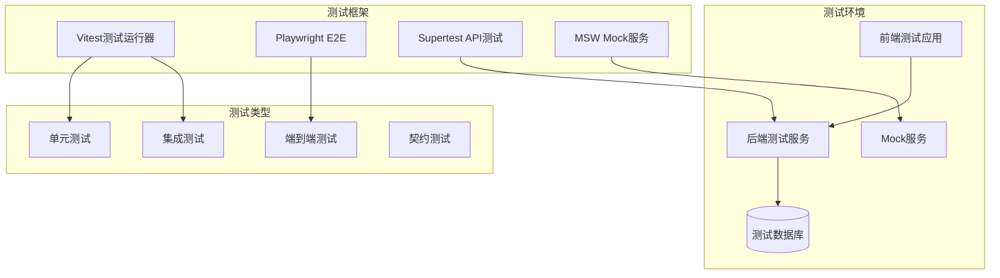

# 前后端集成测试设计文档

## 概述

本设计文档定义了AFA办公小程序系统前后端集成测试的技术架构和实现方案。集成测试框架将验证前端应用与后端API之间的完整交互流程，确保系统各组件协同工作正常，数据流转准确，用户体验符合预期。

设计目标：
- 建立自动化的前后端集成测试体系
- 确保API接口的正确性和稳定性
- 验证用户交互流程的完整性
- 提供可靠的回归测试机制

## 架构

### 测试架构概览



### 分层测试策略

1. **单元测试层**: 测试独立组件和函数
2. **集成测试层**: 测试前后端API交互
3. **端到端测试层**: 测试完整用户流程
4. **契约测试层**: 验证API接口契约

### 技术栈选择

- **测试框架**: Vitest (统一的测试运行器)
- **API测试**: Supertest (HTTP断言测试)
- **E2E测试**: Playwright (跨浏览器自动化)
- **Mock服务**: MSW (Mock Service Worker)
- **测试数据库**: SQLite内存数据库
- **CI/CD**: GitHub Actions

## 组件和接口

### 测试环境组件

#### 1. 测试配置管理器
```typescript
interface TestConfig {
  apiBaseUrl: string;
  databaseUrl: string;
  jwtSecret: string;
  testTimeout: number;
  retryAttempts: number;
}

class TestConfigManager {
  static getConfig(env: 'unit' | 'integration' | 'e2e'): TestConfig;
  static setupEnvironment(config: TestConfig): Promise<void>;
  static teardownEnvironment(): Promise<void>;
}
```

#### 2. 测试数据工厂
```typescript
interface TestDataFactory {
  createUser(overrides?: Partial<User>): User;
  createMerchant(overrides?: Partial<Merchant>): Merchant;
  createVisitor(overrides?: Partial<Visitor>): Visitor;
  createAuthToken(userId: number): string;
}

class DatabaseSeeder {
  static seedTestData(): Promise<void>;
  static cleanDatabase(): Promise<void>;
  static resetSequences(): Promise<void>;
}
```

#### 3. API测试客户端
```typescript
class ApiTestClient {
  constructor(baseUrl: string);
  
  // 认证相关
  async login(credentials: LoginCredentials): Promise<AuthResponse>;
  async refreshToken(token: string): Promise<AuthResponse>;
  
  // 用户管理
  async getUsers(params?: QueryParams): Promise<User[]>;
  async createUser(userData: CreateUserRequest): Promise<User>;
  async updateUser(id: number, userData: UpdateUserRequest): Promise<User>;
  async deleteUser(id: number): Promise<void>;
  
  // 文件操作
  async uploadFile(file: File, metadata?: FileMetadata): Promise<FileResponse>;
  async downloadFile(fileId: string): Promise<Blob>;
  
  // 实时数据
  connectWebSocket(): WebSocket;
  subscribeToUpdates(channel: string): EventSource;
}
```

### 测试工具组件

#### 1. 浏览器测试工具
```typescript
class BrowserTestHelper {
  static async setupBrowser(options?: BrowserOptions): Promise<Browser>;
  static async createPage(browser: Browser): Promise<Page>;
  static async login(page: Page, credentials: LoginCredentials): Promise<void>;
  static async waitForApiResponse(page: Page, url: string): Promise<Response>;
  static async captureNetworkLogs(page: Page): Promise<NetworkLog[]>;
}
```

#### 2. 断言工具
```typescript
class ApiAssertions {
  static expectSuccessResponse(response: Response, expectedData?: any): void;
  static expectErrorResponse(response: Response, expectedCode: number): void;
  static expectValidationError(response: Response, field: string): void;
  static expectAuthenticationError(response: Response): void;
}

class UIAssertions {
  static async expectElementVisible(page: Page, selector: string): Promise<void>;
  static async expectErrorMessage(page: Page, message: string): Promise<void>;
  static async expectLoadingState(page: Page, isLoading: boolean): Promise<void>;
}
```

## 数据模型

### 测试数据模型

#### 1. 测试用例模型
```typescript
interface TestCase {
  id: string;
  name: string;
  description: string;
  category: 'api' | 'ui' | 'integration' | 'e2e';
  priority: 'high' | 'medium' | 'low';
  requirements: string[]; // 关联的需求ID
  setup: TestSetup;
  steps: TestStep[];
  assertions: TestAssertion[];
  cleanup: TestCleanup;
}

interface TestStep {
  action: string;
  target: string;
  data?: any;
  expectedResult?: any;
}
```

#### 2. 测试结果模型
```typescript
interface TestResult {
  testId: string;
  status: 'passed' | 'failed' | 'skipped';
  duration: number;
  error?: TestError;
  screenshots?: string[];
  logs: TestLog[];
  coverage?: CoverageReport;
}

interface TestError {
  message: string;
  stack: string;
  type: 'assertion' | 'timeout' | 'network' | 'system';
}
```

### Mock数据模型

#### 1. API Mock配置
```typescript
interface MockApiConfig {
  endpoint: string;
  method: 'GET' | 'POST' | 'PUT' | 'DELETE';
  response: {
    status: number;
    data: any;
    delay?: number;
  };
  conditions?: MockCondition[];
}

interface MockCondition {
  field: string;
  operator: 'equals' | 'contains' | 'matches';
  value: any;
}
```

## 错误处理

### 测试错误分类

#### 1. 系统级错误
- 测试环境启动失败
- 数据库连接错误
- 网络连接超时
- 浏览器启动失败

#### 2. 测试执行错误
- 断言失败
- 元素定位失败
- API响应超时
- 数据验证错误

#### 3. 环境配置错误
- 配置文件缺失
- 环境变量未设置
- 依赖服务不可用
- 权限配置错误

### 错误处理策略

#### 1. 重试机制
```typescript
class RetryHandler {
  static async withRetry<T>(
    operation: () => Promise<T>,
    maxAttempts: number = 3,
    delay: number = 1000
  ): Promise<T> {
    for (let attempt = 1; attempt <= maxAttempts; attempt++) {
      try {
        return await operation();
      } catch (error) {
        if (attempt === maxAttempts) throw error;
        await this.delay(delay * attempt);
      }
    }
  }
}
```

#### 2. 错误恢复
```typescript
class ErrorRecovery {
  static async handleDatabaseError(error: DatabaseError): Promise<void> {
    // 重置数据库连接
    // 重新初始化测试数据
  }
  
  static async handleBrowserError(error: BrowserError): Promise<void> {
    // 重启浏览器实例
    // 恢复测试状态
  }
  
  static async handleApiError(error: ApiError): Promise<void> {
    // 检查服务状态
    // 重新建立连接
  }
}
```

## 测试策略

### 测试分类和优先级

#### 1. 冒烟测试 (高优先级)
- API健康检查
- 基础认证流程
- 核心数据操作
- 关键页面加载

#### 2. 功能测试 (中优先级)
- 完整CRUD操作
- 权限验证
- 文件上传下载
- 实时数据同步

#### 3. 边界测试 (中优先级)
- 错误处理
- 异常情况
- 性能边界
- 兼容性测试

#### 4. 回归测试 (低优先级)
- 历史bug验证
- 性能回归
- UI一致性
- 数据完整性

### 测试执行策略

#### 1. 并行执行
```typescript
// 测试套件并行配置
export default defineConfig({
  test: {
    pool: 'threads',
    poolOptions: {
      threads: {
        maxThreads: 4,
        minThreads: 2
      }
    }
  }
});
```

#### 2. 测试隔离
- 每个测试用例独立的数据库事务
- 独立的浏览器上下文
- 清理测试产生的副作用
- 避免测试间的数据污染

#### 3. 条件执行
```typescript
// 基于环境的条件测试
describe.skipIf(process.env.NODE_ENV === 'production')('开发环境测试', () => {
  // 仅在开发环境执行的测试
});

// 基于功能标志的条件测试
describe.runIf(process.env.FEATURE_FLAG_ENABLED === 'true')('新功能测试', () => {
  // 仅在功能开启时执行的测试
});
```

### 性能测试策略

#### 1. 响应时间测试
```typescript
interface PerformanceThresholds {
  apiResponseTime: number; // 2秒
  pageLoadTime: number; // 3秒
  fileUploadTime: number; // 10秒
  databaseQueryTime: number; // 500毫秒
}
```

#### 2. 负载测试
- 并发用户模拟
- API吞吐量测试
- 数据库连接池测试
- 内存使用监控

#### 3. 压力测试
- 极限负载测试
- 资源耗尽场景
- 恢复能力测试
- 降级策略验证

### 兼容性测试策略

#### 1. 浏览器兼容性
- Chrome (最新版本)
- Firefox (最新版本)
- Safari (最新版本)
- Edge (最新版本)

#### 2. 设备兼容性
- 桌面端 (1920x1080, 1366x768)
- 平板端 (768x1024)
- 移动端 (375x667, 414x896)

#### 3. 网络环境
- 高速网络 (100Mbps+)
- 中速网络 (10Mbps)
- 低速网络 (3G)
- 网络中断恢复

## 设计决策和理由

### 1. 技术栈选择理由

**Vitest vs Jest**
- 选择Vitest：更好的TypeScript支持，更快的执行速度，与Vite生态系统集成
- 统一测试运行器：减少配置复杂度，提高开发效率

**Playwright vs Cypress**
- 选择Playwright：更好的跨浏览器支持，更稳定的API，更快的执行速度
- 原生TypeScript支持：更好的类型安全

**MSW vs 传统Mock**
- 选择MSW：更接近真实网络环境，更好的开发体验
- 浏览器和Node.js统一：减少Mock代码重复

### 2. 架构设计理由

**分层测试策略**
- 测试金字塔原则：更多单元测试，适量集成测试，少量E2E测试
- 快速反馈：单元测试提供快速反馈，集成测试验证交互

**测试隔离设计**
- 数据隔离：避免测试间相互影响，提高测试可靠性
- 环境隔离：确保测试环境的一致性和可重复性

**并行执行设计**
- 提高执行效率：减少测试执行时间
- 资源优化：合理利用系统资源

### 3. 数据管理策略

**内存数据库选择**
- 快速启动：减少测试环境准备时间
- 数据隔离：每次测试都是全新环境
- 简化配置：无需外部数据库依赖

**测试数据工厂模式**
- 数据一致性：确保测试数据的标准化
- 维护性：集中管理测试数据创建逻辑
- 灵活性：支持数据定制和覆盖

### 4. 错误处理设计

**分类错误处理**
- 精确定位：快速识别问题类型
- 针对性恢复：不同错误采用不同恢复策略
- 日志记录：便于问题追踪和分析

**重试机制设计**
- 网络容错：处理临时网络问题
- 资源竞争：处理并发访问冲突
- 指数退避：避免系统过载