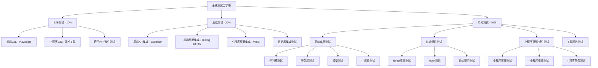

# AFA办公小程序全栈测试覆盖率规范设计文档

## 概述

本设计文档定义了AFA办公小程序完整项目的全栈测试架构，旨在建立一个全面、可维护、高效的测试体系，实现80%以上的代码覆盖率。设计涵盖：

- **后端API服务**: Node.js + Express + TypeScript + Vitest + Supertest
- **前端管理后台**: React + TypeScript + Vite + Vitest + Playwright (租务管理端 + 商户管理端)
- **微信小程序**: 原生小程序 + TypeScript + Vitest

为整个技术栈提供统一的测试规范和工具链。

## 架构设计

### 全栈测试层次架构



### 全栈技术栈架构

```mermaid
graph TB
    A[后端测试栈] --> A1[Vitest - 单元测试]
    A --> A2[Supertest - API测试]
    A --> A3[SQLite内存 - 测试数据库]
    A --> A4[c8 - 覆盖率]
    
    B[前端测试栈] --> B1[Vitest - 单元/集成]
    B --> B2[Playwright - E2E]
    B --> B3[Testing Library - 组件]
    B --> B4[MSW - API Mock]
    
    C[小程序测试栈] --> C1[Vitest - 单元测试]
    C --> C2[微信开发工具 - E2E]
    C --> C3[JSDOM - 环境模拟]
    C --> C4[Mock - 微信API]
    
    D[共享工具] --> D1[Faker.js - 测试数据]
    D --> D2[GitHub Actions - CI/CD]
    D --> D3[统一报告系统]
    D --> D4[跨平台数据工厂]
```



## 组件和接口设计

### 1. 后端测试工具配置

#### Vitest后端配置
```typescript
// backend/vitest.config.js
export default defineConfig({
  test: {
    globals: true,
    environment: 'node',
    setupFiles: ['./tests/setup.ts'],
    coverage: {
      provider: 'v8',
      reporter: ['text', 'json', 'html', 'lcov'],
      reportsDirectory: './coverage',
      exclude: [
        'node_modules/',
        'tests/',
        'dist/',
        '**/*.d.ts',
        '**/*.config.*'
      ],
      thresholds: {
        global: {
          branches: 80,
          functions: 80,
          lines: 80,
          statements: 80
        }
      }
    },
    testTimeout: 10000
  }
})
```

#### 后端测试数据库配置
```typescript
// tests/setup.ts
import { Database } from 'sqlite3'
import { promisify } from 'util'

export class TestDatabase {
  private static instance: Database
  
  static async setup(): Promise<void> {
    this.instance = new Database(':memory:')
    const run = promisify(this.instance.run.bind(this.instance))
    
    // 创建测试表结构
    await run(`
      CREATE TABLE users (
        id INTEGER PRIMARY KEY,
        name TEXT NOT NULL,
        email TEXT UNIQUE NOT NULL,
        password TEXT NOT NULL,
        user_type TEXT NOT NULL,
        created_at DATETIME DEFAULT CURRENT_TIMESTAMP
      )
    `)
    
    // 插入测试数据
    await this.seedTestData()
  }
  
  static async cleanup(): Promise<void> {
    if (this.instance) {
      this.instance.close()
    }
  }
}
```

### 2. 前端测试工具配置

#### Vitest前端配置增强
```typescript
// vite.config.ts 测试配置
export default defineConfig({
  test: {
    globals: true,
    environment: 'jsdom',
    setupFiles: ['./src/test/setup.ts'],
    coverage: {
      provider: 'c8',
      reporter: ['text', 'json', 'html', 'lcov'],
      reportsDirectory: './coverage',
      exclude: [
        'node_modules/',
        'src/test/',
        '**/*.d.ts',
        '**/*.config.*',
        'dist/'
      ],
      thresholds: {
        global: {
          branches: 80,
          functions: 80,
          lines: 80,
          statements: 80
        }
      }
    },
    testTimeout: 10000,
    hookTimeout: 10000
  }
})
```

#### MSW (Mock Service Worker) 集成
```typescript
// frontend/src/test/mocks/handlers.ts
import { rest } from 'msw'

export const handlers = [
  // 认证相关Mock
  rest.post('/api/v1/auth/login', (req, res, ctx) => {
    return res(
      ctx.json({
        success: true,
        data: {
          token: 'mock-jwt-token',
          user: {
            id: 1,
            name: '测试用户',
            email: 'test@example.com',
            userType: 'tenant_admin'
          }
        }
      })
    )
  }),
  
  // 商户管理Mock
  rest.get('/api/v1/merchants', (req, res, ctx) => {
    return res(
      ctx.json({
        success: true,
        data: mockMerchants
      })
    )
  })
]
```

### 3. 小程序测试工具配置

#### 小程序Vitest配置
```typescript
// miniprogram/vitest.config.ts
export default defineConfig({
  test: {
    globals: true,
    environment: 'jsdom',
    setupFiles: ['./tests/setup.ts'],
    coverage: {
      provider: 'v8',
      reporter: ['text', 'json', 'html', 'lcov'],
      reportsDirectory: './coverage',
      exclude: [
        'node_modules/',
        'tests/',
        '**/*.d.ts',
        '**/*.config.*'
      ],
      thresholds: {
        global: {
          branches: 80,
          functions: 80,
          lines: 80,
          statements: 80
        }
      }
    }
  }
})
```

#### 小程序环境模拟
```typescript
// miniprogram/tests/setup.ts
// 模拟微信小程序全局对象
global.wx = {
  // 模拟微信API
  request: vi.fn(),
  showToast: vi.fn(),
  showModal: vi.fn(),
  navigateTo: vi.fn(),
  redirectTo: vi.fn(),
  switchTab: vi.fn(),
  setStorageSync: vi.fn(),
  getStorageSync: vi.fn(),
  removeStorageSync: vi.fn(),
  clearStorageSync: vi.fn(),
  // 更多微信API模拟...
}

// 模拟小程序App和Page构造函数
global.App = vi.fn()
global.Page = vi.fn()
global.Component = vi.fn()
global.getApp = vi.fn(() => ({
  globalData: {}
}))
```

### 4. 全栈测试数据工厂

#### 通用数据工厂设计
```typescript
// shared/test-factories/index.ts - 跨平台共享的数据工厂
export interface TestDataFactory<T> {
  create(overrides?: Partial<T>): T
  createMany(count: number, overrides?: Partial<T>): T[]
  build(overrides?: Partial<T>): T
}

// 用户数据工厂 - 后端、前端、小程序共用
export const userFactory: TestDataFactory<User> = {
  create: (overrides = {}) => ({
    id: faker.number.int(),
    name: faker.person.fullName(),
    email: faker.internet.email(),
    password: faker.internet.password(),
    userType: 'tenant_admin',
    createdAt: faker.date.past().toISOString(),
    ...overrides
  }),
  
  createMany: (count, overrides = {}) => 
    Array.from({ length: count }, () => userFactory.create(overrides)),
    
  build: (overrides = {}) => userFactory.create(overrides)
}

// 商户数据工厂
export const merchantFactory: TestDataFactory<Merchant> = {
  create: (overrides = {}) => ({
    id: faker.number.int(),
    name: faker.company.name(),
    contactPerson: faker.person.fullName(),
    phone: faker.phone.number(),
    email: faker.internet.email(),
    status: 'active',
    spaceIds: [],
    createdAt: faker.date.past().toISOString(),
    updatedAt: faker.date.recent().toISOString(),
    ...overrides
  }),
  
  createMany: (count, overrides = {}) =>
    Array.from({ length: count }, () => merchantFactory.create(overrides)),
    
  build: (overrides = {}) => merchantFactory.create(overrides)
}

// 访客数据工厂
export const visitorFactory: TestDataFactory<Visitor> = {
  create: (overrides = {}) => ({
    id: faker.number.int(),
    name: faker.person.fullName(),
    phone: faker.phone.number(),
    company: faker.company.name(),
    purpose: faker.lorem.sentence(),
    visitDate: faker.date.future().toISOString(),
    status: 'pending',
    qrCode: faker.string.uuid(),
    merchantId: faker.number.int(),
    ...overrides
  }),
  
  createMany: (count, overrides = {}) =>
    Array.from({ length: count }, () => visitorFactory.create(overrides)),
    
  build: (overrides = {}) => visitorFactory.create(overrides)
}

// 空间数据工厂
export const spaceFactory: TestDataFactory<Space> = {
  create: (overrides = {}) => ({
    id: faker.number.int(),
    name: faker.location.buildingNumber() + '号楼',
    type: faker.helpers.arrayElement(['building', 'floor', 'room']),
    parentId: null,
    status: 'active',
    description: faker.lorem.sentence(),
    createdAt: faker.date.past().toISOString(),
    ...overrides
  }),
  
  createMany: (count, overrides = {}) =>
    Array.from({ length: count }, () => spaceFactory.create(overrides)),
    
  build: (overrides = {}) => spaceFactory.create(overrides)
}
```

### 5. 后端测试工具类

#### API测试工具
```typescript
// backend/tests/utils/api-test-helper.ts
import request from 'supertest'
import { app } from '../../src/app'
import { userFactory } from '../../../shared/test-factories'

export class ApiTestHelper {
  static async createAuthenticatedRequest(userOverrides = {}) {
    const user = userFactory.create(userOverrides)
    
    // 创建用户并获取token
    const loginResponse = await request(app)
      .post('/api/v1/auth/login')
      .send({
        email: user.email,
        password: 'password123'
      })
    
    const token = loginResponse.body.data.token
    
    return {
      user,
      token,
      request: (method: string, url: string) => 
        request(app)[method](url).set('Authorization', `Bearer ${token}`)
    }
  }
  
  static expectSuccessResponse(response: any, expectedData?: any) {
    expect(response.status).toBe(200)
    expect(response.body.success).toBe(true)
    if (expectedData) {
      expect(response.body.data).toMatchObject(expectedData)
    }
  }
  
  static expectErrorResponse(response: any, expectedStatus: number, expectedMessage?: string) {
    expect(response.status).toBe(expectedStatus)
    expect(response.body.success).toBe(false)
    if (expectedMessage) {
      expect(response.body.message).toContain(expectedMessage)
    }
  }
}
```

#### 数据库测试工具
```typescript
// backend/tests/utils/database-helper.ts
export class DatabaseTestHelper {
  static async seedUsers(count = 5) {
    const users = userFactory.createMany(count)
    // 插入到测试数据库
    return users
  }
  
  static async seedMerchants(count = 3) {
    const merchants = merchantFactory.createMany(count)
    // 插入到测试数据库
    return merchants
  }
  
  static async cleanup() {
    // 清理测试数据
    await TestDatabase.cleanup()
  }
}
```

### 6. 前端测试工具类

#### 前端渲染工具
```typescript
// frontend/src/test/utils/render.tsx
import { render, RenderOptions } from '@testing-library/react'
import { BrowserRouter } from 'react-router-dom'
import { ConfigProvider } from 'antd'
import zhCN from 'antd/locale/zh_CN'
import { AuthProvider } from '../../contexts/AuthContext'

interface CustomRenderOptions extends Omit<RenderOptions, 'wrapper'> {
  initialEntries?: string[]
  user?: User | null
}

export const renderWithProviders = (
  ui: React.ReactElement,
  options: CustomRenderOptions = {}
) => {
  const { initialEntries = ['/'], user = null, ...renderOptions } = options

  const Wrapper: React.FC<{ children: React.ReactNode }> = ({ children }) => (
    <BrowserRouter>
      <ConfigProvider locale={zhCN}>
        <AuthProvider initialUser={user}>
          {children}
        </AuthProvider>
      </ConfigProvider>
    </BrowserRouter>
  )

  return render(ui, { wrapper: Wrapper, ...renderOptions })
}

// 重新导出所有testing-library工具
export * from '@testing-library/react'
export { renderWithProviders as render }
```

#### 前端API测试工具
```typescript
// frontend/src/test/utils/api.ts
export class FrontendApiTestHelper {
  static mockSuccessResponse<T>(data: T) {
    return {
      success: true,
      data,
      message: '操作成功',
      timestamp: new Date().toISOString()
    }
  }

  static mockErrorResponse(message: string, code?: number) {
    return {
      success: false,
      code: code || 500,
      message,
      data: null,
      timestamp: new Date().toISOString()
    }
  }

  static createMockAxiosResponse<T>(data: T, status = 200) {
    return {
      data,
      status,
      statusText: 'OK',
      headers: {},
      config: {}
    }
  }
}
```

### 7. 小程序测试工具类

#### 小程序页面测试工具
```typescript
// miniprogram/tests/utils/page-helper.ts
export class MiniprogramPageHelper {
  static mockPageContext(data = {}, methods = {}) {
    return {
      data,
      setData: vi.fn((newData, callback) => {
        Object.assign(data, newData)
        if (callback) callback()
      }),
      ...methods
    }
  }
  
  static mockWxApi() {
    return {
      request: vi.fn().mockResolvedValue({
        statusCode: 200,
        data: { success: true }
      }),
      showToast: vi.fn(),
      showModal: vi.fn().mockResolvedValue({ confirm: true }),
      navigateTo: vi.fn(),
      setStorageSync: vi.fn(),
      getStorageSync: vi.fn()
    }
  }
  
  static expectPageData(pageContext: any, expectedData: any) {
    expect(pageContext.data).toMatchObject(expectedData)
  }
  
  static expectWxApiCalled(apiName: string, expectedParams?: any) {
    expect(wx[apiName]).toHaveBeenCalled()
    if (expectedParams) {
      expect(wx[apiName]).toHaveBeenCalledWith(
        expect.objectContaining(expectedParams)
      )
    }
  }
}
```

#### 小程序组件测试工具
```typescript
// miniprogram/tests/utils/component-helper.ts
export class MiniprogramComponentHelper {
  static mockComponentContext(properties = {}, data = {}, methods = {}) {
    return {
      properties,
      data,
      setData: vi.fn((newData, callback) => {
        Object.assign(data, newData)
        if (callback) callback()
      }),
      triggerEvent: vi.fn(),
      ...methods
    }
  }
  
  static expectComponentEvent(component: any, eventName: string, eventDetail?: any) {
    expect(component.triggerEvent).toHaveBeenCalledWith(eventName, eventDetail)
  }
}
```

## 数据模型设计

### 测试配置模型
```typescript
// src/test/types/config.ts
export interface TestConfig {
  timeout: number
  retries: number
  coverage: CoverageConfig
  mock: MockConfig
}

export interface CoverageConfig {
  threshold: {
    global: CoverageThreshold
    perFile?: CoverageThreshold
  }
  exclude: string[]
  include: string[]
}

export interface CoverageThreshold {
  branches: number
  functions: number
  lines: number
  statements: number
}

export interface MockConfig {
  api: {
    baseURL: string
    delay?: number
  }
  localStorage: boolean
  sessionStorage: boolean
}
```

### 测试用例模型
```typescript
// src/test/types/test-case.ts
export interface TestCase {
  id: string
  name: string
  description: string
  category: TestCategory
  priority: TestPriority
  tags: string[]
  setup?: () => void | Promise<void>
  teardown?: () => void | Promise<void>
}

export enum TestCategory {
  UNIT = 'unit',
  INTEGRATION = 'integration',
  E2E = 'e2e'
}

export enum TestPriority {
  CRITICAL = 'critical',
  HIGH = 'high',
  MEDIUM = 'medium',
  LOW = 'low'
}
```

## 错误处理设计

### 测试错误分类
```typescript
// src/test/utils/errors.ts
export class TestError extends Error {
  constructor(
    message: string,
    public category: ErrorCategory,
    public context?: Record<string, any>
  ) {
    super(message)
    this.name = 'TestError'
  }
}

export enum ErrorCategory {
  SETUP_FAILURE = 'setup_failure',
  ASSERTION_FAILURE = 'assertion_failure',
  TIMEOUT = 'timeout',
  MOCK_FAILURE = 'mock_failure',
  NETWORK_ERROR = 'network_error'
}

export class TestErrorHandler {
  static handle(error: Error, context: TestContext): void {
    console.error(`测试失败: ${error.message}`, {
      testName: context.testName,
      category: context.category,
      timestamp: new Date().toISOString(),
      stack: error.stack
    })
    
    // 根据错误类型进行不同处理
    if (error instanceof TestError) {
      this.handleTestError(error, context)
    } else {
      this.handleUnknownError(error, context)
    }
  }
  
  private static handleTestError(error: TestError, context: TestContext): void {
    // 记录详细的测试错误信息
    // 可以集成到监控系统
  }
  
  private static handleUnknownError(error: Error, context: TestContext): void {
    // 处理未知错误
  }
}
```

## 测试策略设计

### 1. 单元测试策略

#### 组件测试模式
```typescript
// 组件测试模板
describe('ComponentName', () => {
  // 基础渲染测试
  it('should render correctly', () => {
    render(<ComponentName />)
    expect(screen.getByRole('...')).toBeInTheDocument()
  })
  
  // Props测试
  it('should handle props correctly', () => {
    const props = { ... }
    render(<ComponentName {...props} />)
    // 验证props的影响
  })
  
  // 事件处理测试
  it('should handle events correctly', async () => {
    const mockHandler = vi.fn()
    render(<ComponentName onEvent={mockHandler} />)
    
    await user.click(screen.getByRole('button'))
    expect(mockHandler).toHaveBeenCalledWith(...)
  })
  
  // 状态变化测试
  it('should update state correctly', async () => {
    render(<ComponentName />)
    // 触发状态变化
    // 验证UI更新
  })
  
  // 错误边界测试
  it('should handle errors gracefully', () => {
    // 测试错误情况
  })
})
```

#### 服务测试模式
```typescript
// API服务测试模板
describe('ServiceName', () => {
  beforeEach(() => {
    // 重置Mock
    vi.clearAllMocks()
  })
  
  // 成功场景测试
  it('should handle successful requests', async () => {
    const mockData = factory.create()
    api.get.mockResolvedValue(ApiTestHelper.mockSuccessResponse(mockData))
    
    const result = await service.getData()
    
    expect(api.get).toHaveBeenCalledWith('/endpoint')
    expect(result).toEqual(mockData)
  })
  
  // 错误场景测试
  it('should handle error responses', async () => {
    const errorMessage = '请求失败'
    api.get.mockRejectedValue(new Error(errorMessage))
    
    await expect(service.getData()).rejects.toThrow(errorMessage)
  })
  
  // 参数验证测试
  it('should validate parameters', async () => {
    const invalidParams = { ... }
    
    await expect(service.createData(invalidParams))
      .rejects.toThrow('参数验证失败')
  })
})
```

### 2. 集成测试策略

#### 页面级集成测试
```typescript
// 页面集成测试模板
describe('PageName Integration', () => {
  beforeEach(() => {
    // 设置Mock数据
    server.use(
      rest.get('/api/v1/data', (req, res, ctx) => {
        return res(ctx.json(mockData))
      })
    )
  })
  
  it('should load and display data correctly', async () => {
    render(<PageName />)
    
    // 等待数据加载
    await waitFor(() => {
      expect(screen.getByText('数据内容')).toBeInTheDocument()
    })
    
    // 验证页面状态
    expect(screen.getByRole('table')).toBeInTheDocument()
  })
  
  it('should handle user interactions', async () => {
    render(<PageName />)
    
    // 模拟用户操作
    await user.click(screen.getByRole('button', { name: '新增' }))
    
    // 验证交互结果
    expect(screen.getByRole('dialog')).toBeInTheDocument()
  })
})
```

### 3. E2E测试策略

#### 用户流程测试
```typescript
// E2E测试模板
test.describe('User Flow', () => {
  test.beforeEach(async ({ page }) => {
    // 设置测试环境
    await page.goto('/')
  })
  
  test('complete user workflow', async ({ page }) => {
    // 登录流程
    await page.fill('[data-testid="email"]', 'test@example.com')
    await page.fill('[data-testid="password"]', 'password')
    await page.click('[data-testid="login-button"]')
    
    // 验证登录成功
    await expect(page.locator('[data-testid="dashboard"]')).toBeVisible()
    
    // 执行业务操作
    await page.click('[data-testid="merchants-menu"]')
    await page.click('[data-testid="add-merchant"]')
    
    // 填写表单
    await page.fill('[data-testid="merchant-name"]', '测试商户')
    await page.click('[data-testid="submit"]')
    
    // 验证结果
    await expect(page.locator('text=创建成功')).toBeVisible()
  })
})
```

## 性能和监控设计

### 测试性能监控
```typescript
// src/test/utils/performance.ts
export class TestPerformanceMonitor {
  private static metrics: Map<string, PerformanceMetric> = new Map()
  
  static startTimer(testName: string): void {
    this.metrics.set(testName, {
      startTime: performance.now(),
      testName
    })
  }
  
  static endTimer(testName: string): number {
    const metric = this.metrics.get(testName)
    if (!metric) return 0
    
    const duration = performance.now() - metric.startTime
    metric.duration = duration
    
    // 记录性能数据
    this.recordMetric(metric)
    
    return duration
  }
  
  private static recordMetric(metric: PerformanceMetric): void {
    // 发送到监控系统或记录到文件
    console.log(`测试性能: ${metric.testName} - ${metric.duration}ms`)
  }
}
```

### 覆盖率监控
```typescript
// src/test/utils/coverage.ts
export class CoverageMonitor {
  static checkThreshold(coverage: CoverageReport): boolean {
    const thresholds = {
      statements: 80,
      branches: 80,
      functions: 80,
      lines: 80
    }
    
    return Object.entries(thresholds).every(([key, threshold]) => {
      const actual = coverage[key as keyof CoverageReport]
      return actual >= threshold
    })
  }
  
  static generateReport(coverage: CoverageReport): CoverageReportSummary {
    return {
      overall: this.calculateOverallCoverage(coverage),
      byCategory: this.groupByCategory(coverage),
      recommendations: this.generateRecommendations(coverage)
    }
  }
}
```

## 部署和CI/CD集成

### GitHub Actions配置
```yaml
# .github/workflows/test.yml
name: Frontend Tests

on:
  push:
    branches: [ main, develop ]
  pull_request:
    branches: [ main ]

jobs:
  test:
    runs-on: ubuntu-latest
    
    steps:
    - uses: actions/checkout@v3
    
    - name: Setup Node.js
      uses: actions/setup-node@v3
      with:
        node-version: '18'
        cache: 'pnpm'
    
    - name: Install dependencies
      run: pnpm install
    
    - name: Run unit tests
      run: pnpm test:coverage
    
    - name: Run E2E tests
      run: pnpm test:e2e
    
    - name: Upload coverage reports
      uses: codecov/codecov-action@v3
      with:
        file: ./coverage/lcov.info
    
    - name: Comment PR with coverage
      uses: marocchino/sticky-pull-request-comment@v2
      with:
        recreate: true
        path: coverage/coverage-summary.md
```

### 测试报告生成
```typescript
// scripts/generate-test-report.ts
export class TestReportGenerator {
  static async generateReport(): Promise<TestReport> {
    const unitTestResults = await this.getUnitTestResults()
    const e2eTestResults = await this.getE2ETestResults()
    const coverageReport = await this.getCoverageReport()
    
    return {
      summary: this.generateSummary(unitTestResults, e2eTestResults),
      coverage: coverageReport,
      recommendations: this.generateRecommendations(coverageReport),
      timestamp: new Date().toISOString()
    }
  }
  
  static async publishReport(report: TestReport): Promise<void> {
    // 发布到测试报告系统
    // 发送通知
    // 更新仪表板
  }
}
```

这个设计文档提供了完整的测试架构，包括工具配置、数据模型、错误处理、测试策略和CI/CD集成，为实现80%代码覆盖率提供了详细的技术方案。