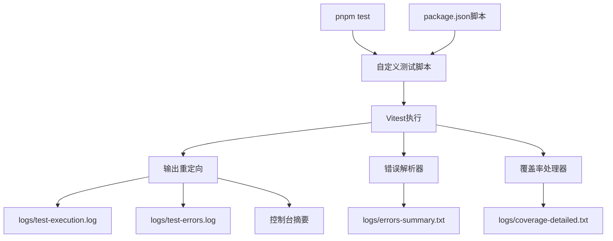

# 测试执行输出优化设计文档

## 概述

本设计文档描述了如何优化现有的 `pnpm test` 命令输出，通过修改vitest配置和添加自定义脚本，将详细的测试执行信息重定向到日志文件，控制台只显示关键摘要，从而减少上下文占用并提供AI可读的错误信息。

## 架构

### 整体架构图



### 核心组件

1. **测试脚本包装器**: 包装vitest命令，控制输出重定向
2. **输出解析器**: 解析vitest输出，提取关键信息
3. **错误提取器**: 从测试输出中提取失败信息
4. **摘要生成器**: 生成简洁的控制台摘要
5. **日志文件管理器**: 管理不同类型的日志文件
6. **覆盖率处理器**: 处理覆盖率报告的输出

## 组件和接口

### 1. 测试脚本包装器

```bash
#!/bin/bash
# test-wrapper.sh - 包装vitest执行并控制输出

LOG_DIR="logs"
VERBOSE=${1:-false}

# 创建日志目录
mkdir -p "$LOG_DIR"

if [ "$VERBOSE" = "true" ]; then
  # 详细模式：显示完整输出
  vitest --run
else
  # 简洁模式：重定向输出到文件
  vitest --run > "$LOG_DIR/test-execution.log" 2>&1
  
  # 解析结果并显示摘要
  node scripts/parse-test-results.js
fi
```

### 2. 输出解析器

```typescript
interface TestOutputParser {
  parseTestResults(logContent: string): TestSummary;
  extractErrors(logContent: string): TestError[];
  extractCoverage(logContent: string): CoverageSummary;
  generateConsoleSummary(summary: TestSummary): string;
}

interface TestSummary {
  totalTests: number;
  passed: number;
  failed: number;
  skipped: number;
  duration: string;
  hasErrors: boolean;
}
```

### 3. 错误提取器

```typescript
interface ErrorExtractor {
  extractFailedTests(logContent: string): FailedTest[];
  generateErrorSummary(errors: FailedTest[]): string;
  saveErrorDetails(errors: FailedTest[], filePath: string): void;
}

interface FailedTest {
  testFile: string;
  testName: string;
  errorMessage: string;
  errorStack?: string;
  line?: number;
}
```

### 4. 摘要生成器

```typescript
interface SummaryGenerator {
  generateConsoleSummary(summary: TestSummary, errors: FailedTest[]): string;
  generateErrorSummaryFile(errors: FailedTest[]): string;
  formatDuration(ms: number): string;
  formatTestCount(passed: number, failed: number, total: number): string;
}

// 控制台输出示例
const consoleSummary = `
✅ Tests: 156 passed, 2 failed, 158 total
⏱️  Time: 12.34s
${errors.length > 0 ? '❌ Error details: logs/errors-summary.txt' : ''}
${coverage ? `📊 Coverage: ${coverage.lines}% lines` : ''}
`;
```

### 5. 覆盖率处理器

```typescript
interface CoverageProcessor {
  extractCoverageFromLog(logContent: string): CoverageData;
  generateCoverageSummary(coverage: CoverageData): string;
  saveCoverageDetails(coverage: CoverageData, filePath: string): void;
}

interface CoverageData {
  lines: { covered: number; total: number; percentage: number };
  functions: { covered: number; total: number; percentage: number };
  branches: { covered: number; total: number; percentage: number };
  statements: { covered: number; total: number; percentage: number };
}
```

## 数据模型

### 测试摘要结构

```typescript
interface TestSummary {
  timestamp: string;
  totalTests: number;
  passed: number;
  failed: number;
  skipped: number;
  duration: string;
  hasErrors: boolean;
  coverage?: {
    lines: number;
    functions: number;
    branches: number;
    statements: number;
  };
}
```

### 错误信息结构

```typescript
interface FailedTest {
  testFile: string;
  testName: string;
  errorMessage: string;
  errorType?: string;
  line?: number;
  column?: number;
}

// errors-summary.txt 格式示例
const errorSummaryFormat = `
测试失败摘要 (2024-01-01 10:30:00)
=====================================

失败测试数量: 3

1. auth.test.ts > JWT token validation
   错误: Expected true but received false

2. user.test.ts > User creation with invalid email  
   错误: ValidationError: Invalid email format

3. payment.test.ts > Payment processing timeout
   错误: TimeoutError: Request timeout after 5000ms

详细错误信息请查看: logs/test-errors.log
完整测试输出请查看: logs/test-execution.log
`;
```

## 错误处理

### 错误分类和处理策略

1. **文件系统错误**
   - 日志目录创建失败：回退到临时目录
   - 磁盘空间不足：启用日志压缩和清理
   - 权限不足：降级到只读模式

2. **测试执行错误**
   - 测试超时：记录超时信息并继续
   - 内存不足：启用内存监控和警告
   - 依赖缺失：记录详细错误信息

3. **日志系统错误**
   - 日志写入失败：回退到控制台输出
   - 报告生成失败：生成简化版本报告
   - 配置错误：使用默认配置并警告

### 错误恢复机制

```typescript
interface ErrorRecovery {
  // 自动恢复策略
  autoRecover(error: Error, context: ErrorContext): Promise<boolean>;
  
  // 降级策略
  fallbackToConsole(): void;
  fallbackToMinimalLogging(): void;
  
  // 错误通知
  notifyError(error: Error, severity: 'low' | 'medium' | 'high'): void;
}
```

## 测试策略

### 单元测试

1. **日志管理器测试**
   - 测试不同日志级别的输出
   - 测试文件写入和轮转功能
   - 测试错误处理和恢复机制

2. **Reporter测试**
   - 测试Vitest集成
   - 测试事件处理和数据收集
   - 测试报告生成的准确性

3. **文件操作测试**
   - 测试日志文件创建和写入
   - 测试文件轮转和清理
   - 测试并发写入安全性

### 集成测试

1. **端到端测试流程**
   - 完整测试执行流程
   - 日志文件生成验证
   - 报告数据准确性验证

2. **性能测试**
   - 大量测试文件的处理性能
   - 日志写入性能影响
   - 内存使用情况监控

### 测试数据和Mock

```typescript
// 测试用的Mock数据
const mockTestResults = {
  passed: [
    { file: 'auth.test.ts', tests: 10, duration: 150 },
    { file: 'user.test.ts', tests: 8, duration: 120 }
  ],
  failed: [
    { 
      file: 'payment.test.ts', 
      error: 'Connection timeout',
      stack: 'Error: timeout at...'
    }
  ]
};
```

## 配置管理

### Package.json 脚本配置

```json
{
  "scripts": {
    "test": "node scripts/test-runner.js",
    "test:verbose": "node scripts/test-runner.js --verbose",
    "test:silent": "node scripts/test-runner.js --silent", 
    "test:debug": "node scripts/test-runner.js --debug",
    "test:coverage": "node scripts/test-runner.js --coverage",
    "test:original": "vitest --run"
  }
}
```

### 测试运行器配置

```javascript
// scripts/test-runner.js
const config = {
  logDir: 'logs',
  verbose: process.argv.includes('--verbose'),
  silent: process.argv.includes('--silent'),
  debug: process.argv.includes('--debug'),
  coverage: process.argv.includes('--coverage'),
  
  // 输出文件配置
  files: {
    execution: 'logs/test-execution.log',
    errors: 'logs/test-errors.log',
    errorsSummary: 'logs/errors-summary.txt',
    coverage: 'logs/coverage-detailed.txt'
  }
};
```

## 实现方案

### 文件结构

```
afa-office-system/backend/
├── scripts/
│   ├── test-runner.js           # 主测试运行器
│   ├── parse-test-output.js     # 输出解析器
│   └── generate-summary.js      # 摘要生成器
├── logs/                        # 日志目录（自动创建）
│   ├── test-execution.log       # 完整测试输出
│   ├── test-errors.log          # 错误详情
│   ├── errors-summary.txt       # AI可读的错误摘要
│   └── coverage-detailed.txt    # 详细覆盖率报告
└── package.json                 # 更新的脚本配置
```

### 实现步骤

1. **创建测试运行器脚本**: 包装vitest命令，控制输出重定向
2. **实现输出解析器**: 解析vitest输出，提取关键信息
3. **创建摘要生成器**: 生成简洁的控制台输出和AI可读的错误文件
4. **更新package.json**: 添加新的测试脚本命令
5. **测试和优化**: 验证输出效果，调整格式和内容

### 控制台输出示例

```bash
$ pnpm test

🧪 Running tests...

✅ Tests completed
   📊 Results: 156 passed, 2 failed (158 total)
   ⏱️  Duration: 12.34s
   📈 Coverage: 85.2% lines, 78.9% functions
   
❌ 2 tests failed - details saved to:
   📄 Error summary: logs/errors-summary.txt
   📋 Full details: logs/test-errors.log
   📊 Complete output: logs/test-execution.log
```

## 性能考虑

### 优化策略

1. **异步日志写入**: 使用缓冲区和异步I/O减少性能影响
2. **日志级别过滤**: 在写入前过滤不必要的日志
3. **批量写入**: 批量处理日志条目减少I/O操作
4. **内存管理**: 及时清理日志缓冲区避免内存泄漏

### 性能指标

- 日志系统开销应小于总测试时间的5%
- 单个日志条目写入时间应小于1ms
- 内存使用增长应小于10MB
- 文件I/O不应阻塞测试执行