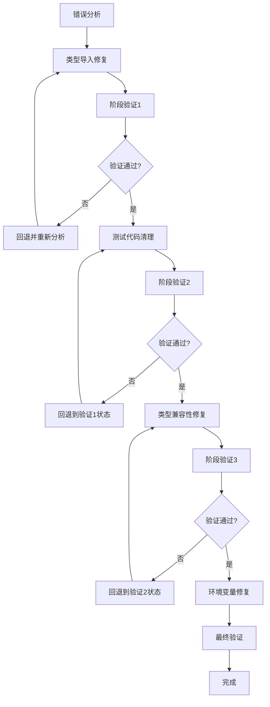

# TypeScript 错误修复设计文档

## 概述

本设计文档详细说明了如何系统性地修复 AFA 办公系统后端项目中的 TypeScript 类型错误。基于错误分析，我们采用分阶段、手动修复的方式，确保每个修复步骤都经过验证。

## 架构

### 修复流程架构



### 错误分类和优先级

1. **高优先级**: 类型导入错误 (阻塞编译)
2. **中优先级**: 测试代码混入 (影响生产代码质量)
3. **中优先级**: exactOptionalPropertyTypes 兼容性
4. **低优先级**: 环境变量类型安全

## 组件和接口

### 1. 类型系统重构组件

#### 类型导出管理器
```typescript
// 负责管理所有类型的正确导出
interface TypeExportManager {
  validateExports(): ValidationResult;
  fixMissingExports(): void;
  verifyImports(): ImportValidationResult;
}
```

#### API 类型集成器
```typescript
// 确保 API 类型正确集成到主类型系统
interface ApiTypeIntegrator {
  integrateApiTypes(): void;
  validateApiTypeConsistency(): boolean;
  resolveTypeConflicts(): void;
}
```

### 2. 代码清理组件

#### 测试代码检测器
```typescript
// 检测生产代码中的测试相关代码
interface TestCodeDetector {
  scanForTestCode(filePath: string): TestCodeIssue[];
  identifyMockUsage(): MockUsageReport;
  generateCleanupPlan(): CleanupPlan;
}
```

#### 生产代码净化器
```typescript
// 清理生产代码中的测试依赖
interface ProductionCodePurifier {
  removeMockReferences(filePath: string): void;
  replaceTestTypes(filePath: string): void;
  validatePurification(): PurificationResult;
}
```

### 3. 类型兼容性修复组件

#### 可选属性处理器
```typescript
// 处理 exactOptionalPropertyTypes 相关问题
interface OptionalPropertyHandler {
  analyzeOptionalProperties(): PropertyAnalysis;
  fixUndefinedAssignments(): void;
  validateTypeCompatibility(): CompatibilityResult;
}
```

#### 类型转换器
```typescript
// 处理类型转换和兼容性
interface TypeConverter {
  convertUndefinedToNull(value: any): any;
  ensureTypeCompatibility(source: any, target: any): any;
  validateConversion(): ConversionResult;
}
```

## 数据模型

### 错误跟踪模型
```typescript
interface TypeScriptError {
  id: string;
  file: string;
  line: number;
  column: number;
  code: string;
  message: string;
  category: ErrorCategory;
  priority: Priority;
  status: 'pending' | 'in_progress' | 'fixed' | 'verified';
  fixAttempts: FixAttempt[];
}

interface FixAttempt {
  timestamp: string;
  approach: string;
  result: 'success' | 'failure' | 'partial';
  newErrors?: TypeScriptError[];
  notes: string;
}
```

### 修复状态模型
```typescript
interface FixSession {
  id: string;
  startTime: string;
  currentPhase: Phase;
  completedPhases: Phase[];
  errorSnapshot: TypeScriptError[];
  checkpoints: Checkpoint[];
  rollbackPoints: RollbackPoint[];
}

interface Checkpoint {
  phase: Phase;
  timestamp: string;
  errorCount: number;
  fixedErrors: string[];
  newErrors: string[];
}
```

## 错误处理

### 错误分类策略
```typescript
enum ErrorCategory {
  TYPE_IMPORT = 'type_import',
  MOCK_FUNCTION = 'mock_function', 
  EXACT_OPTIONAL = 'exact_optional',
  ENV_VARIABLE = 'env_variable',
  UNKNOWN = 'unknown'
}

enum Priority {
  CRITICAL = 1,  // 阻塞编译
  HIGH = 2,      // 影响核心功能
  MEDIUM = 3,    // 影响代码质量
  LOW = 4        // 优化性问题
}
```

### 回退机制
```typescript
interface RollbackManager {
  createCheckpoint(phase: Phase): CheckpointId;
  rollbackToCheckpoint(checkpointId: CheckpointId): void;
  validateRollback(): boolean;
  listAvailableCheckpoints(): Checkpoint[];
}
```

## 测试策略

### 验证流程
1. **语法验证**: 确保修复后代码能够编译
2. **类型验证**: 确保类型系统一致性
3. **功能验证**: 确保修复不影响业务逻辑
4. **回归验证**: 确保没有引入新问题

### 测试检查点
```typescript
interface ValidationCheckpoint {
  phase: Phase;
  checks: ValidationCheck[];
  passThreshold: number; // 通过阈值
  rollbackOnFailure: boolean;
}

interface ValidationCheck {
  name: string;
  command: string;
  expectedResult: 'success' | 'no_errors';
  timeout: number;
}
```

## 实施计划

### 阶段 1: 类型导入修复
**目标**: 解决所有 "Module has no exported member" 错误

**技术方案**:
1. 分析 `src/types/index.ts` 的导出结构
2. 识别缺失的 API 类型导出
3. 从 `src/types/api.ts` 正确导出所需类型
4. 验证所有控制器文件的类型导入

**验证标准**: 
- 所有类型导入错误消失
- 不引入新的编译错误
- 控制器文件能正确识别所有导入的类型

### 阶段 2: 测试代码清理
**目标**: 移除生产代码中的 MockedFunction 引用

**技术方案**:
1. 扫描所有控制器文件中的 MockedFunction 使用
2. 识别测试相关的代码片段
3. 将测试代码移动到适当的测试文件
4. 确保生产代码只包含生产逻辑

**验证标准**:
- 所有 MockedFunction 错误消失
- 生产代码不包含测试框架依赖
- 功能逻辑保持完整

### 阶段 3: 类型兼容性修复
**目标**: 解决 exactOptionalPropertyTypes 相关错误

**技术方案**:
1. 识别所有 `undefined` 与 `null` 类型冲突
2. 更新接口定义以支持严格的可选属性
3. 修复数据转换函数
4. 确保 API 数据结构的类型一致性

**验证标准**:
- 所有 exactOptionalPropertyTypes 错误消失
- 数据类型转换正确
- API 接口类型一致

### 阶段 4: 环境变量修复
**目标**: 确保环境变量的类型安全

**技术方案**:
1. 为所有环境变量提供默认值
2. 更新配置管理器的类型处理
3. 确保不会将 `undefined` 赋值给 `string` 类型

**验证标准**:
- 所有环境变量类型错误消失
- 配置系统稳定运行
- 提供合理的默认值

### 阶段 5: 最终验证
**目标**: 确保所有错误都已修复

**验证流程**:
1. 运行完整的类型检查
2. 确认错误数量为零
3. 运行基础功能测试
4. 生成修复报告

## 风险管理

### 主要风险
1. **修复引入新错误**: 通过阶段性验证和回退机制控制
2. **功能逻辑破坏**: 通过最小化修改和功能验证控制
3. **类型系统不一致**: 通过系统性的类型重构控制

### 缓解策略
1. **增量修复**: 每次只修复一类错误
2. **频繁验证**: 每个阶段都进行完整验证
3. **快速回退**: 发现问题立即回退到稳定状态
4. **详细记录**: 记录每个修复步骤和结果

## 成功标准

### 技术指标
- TypeScript 编译错误数量: 0
- 类型覆盖率: 保持现有水平
- 编译时间: 不显著增加

### 质量指标
- 代码可维护性: 提升
- 类型安全性: 显著提升
- 开发体验: 改善

### 验收标准
- `pnpm type-check` 命令成功执行且无错误
- 所有控制器和服务文件通过类型检查
- 生产代码不包含测试相关依赖
- 环境变量处理安全可靠